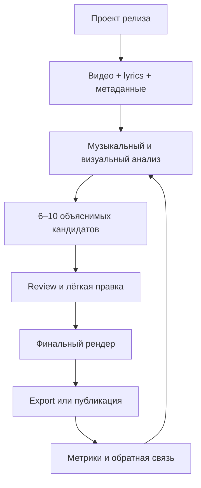
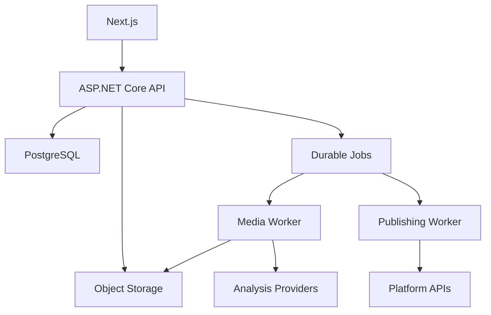

# AI Content Factory for Musicians

## Скорректированный продуктовый, бизнес- и технический план

> Версия: 2.0  
> Дата актуализации: 9 июля 2026 года  
> Статус: рабочая концепция для проверки спроса и разработки MVP

---

## 1. Резюме и итоговая рекомендация

Идея жизнеспособна, но исходный план описывал набор функций, а не защищённый продукт. Формула «загрузить длинное видео → получить Shorts → опубликовать» уже реализована общими AI-клипперами и сервисами кросспостинга. Если сделать ещё один универсальный аналог, придётся конкурировать ценой с OpusClip, Klap, Vizard и Repurpose.io.

Правильный продуктовый центр:

> **Не AI-нарезка видео, а автоматизированная промокампания музыкального релиза.**

Рабочее позиционирование:

> Загрузи музыкальный клип, текст песни и дату релиза — получи набор разных вертикальных роликов, синхронизированных со структурой песни, готовые тексты и план публикаций на 2–4 недели.

Главный пользовательский результат первой продаваемой версии:

> Пользователь загружает один музыкальный клип, получает 6–10 осмысленных кандидатов, быстро исправляет границы, кадр и текст, затем скачивает готовые MP4, субтитры и описания. Социальные интеграции добавляются после подтверждения качества core-продукта и не блокируют запуск.

Вердикт: **условный GO**, если concierge-пилот подтвердит три гипотезы:

1. Музыканты готовы платить не за «AI», а за законченную кампанию релиза.
2. Не менее половины выбранных AI-фрагментов пригодны к публикации после минимальных правок.
3. Пользователи возвращаются со следующим релизом.

### Что принципиально изменено

| Было в исходном плане | Стало в скорректированном плане |
|---|---|
| Универсальный продукт для музыкантов, лейблов и контент-мейкеров | Первый ICP — независимые и AI-музыканты с готовым клипом, lyric video или visualizer |
| «AI найдёт лучшие моменты» | Объяснимый гибридный анализ: структура песни, энергия, lyrics, сцены, движение и разнообразие результатов |
| Whisper как достаточное решение | Текст песни или SRT/VTT — предпочтительный источник; распознавание вокала — fallback с оценкой уверенности |
| Простое кадрирование 9:16 | Fit + blurred background, Fill + ручное позиционирование, safe zones; smart reframe позже |
| YouTube и TikTok внутри MVP | Core MVP заканчивается экспортом; интеграции подключаются независимо через feature flags |
| TikTok Draft | Корректное название — TikTok Upload: видео уходит во входящие, а пользователь завершает публикацию в приложении |
| TikTok Direct Post как обычная backend-фича | Отдельный продуктовый и compliance-трек с аудитом, обязательным preview и явным согласием пользователя |
| VK как гарантированная публикация в Clips | Технический spike: обычная загрузка VK Video подтверждена схемой API, попадание именно в Clips нужно доказать тестом и согласованием |
| Пять тарифов с первого дня | Concierge-оплата + разовый Release Pack + 1–2 подписки; Agency только после реального спроса |
| Себестоимость кампании $1–2 и маржа 70–85% как факт | $1–2 может быть только direct compute; полная экономика считается по телеметрии, комиссиям, возвратам и поддержке |
| Микросервисы/Kubernetes подразумеваются будущим масштабом | Модульный монолит, отдельный worker и durable jobs; Kubernetes только после появления измеренной необходимости |
| Автоматизация вокруг CapCut | Независимый FFmpeg-пайплайн; CapCut остаётся ручным fallback, а не критической зависимостью продукта |

---

## 2. Продуктовая стратегия

### 2.1. Основной ICP

Первый идеальный пользователь — продуктивный независимый музыкант или AI-артист, который:

- выпускает 1–2 и более треков в месяц;
- имеет готовый клип, AI-видео, visualizer или lyric video длительностью примерно 2–10 минут;
- самостоятельно ведёт YouTube Shorts, TikTok и Instagram/VK;
- сейчас использует CapCut, ChatGPT и ручную загрузку;
- не имеет постоянного монтажёра и SMM-команды;
- теряет 2–5 часов на подготовку short-контента для одного релиза;
- готов платить $20–70 в месяц или покупать отдельные пакеты релизов.

AI-музыканты подходят для раннего dogfooding из-за высокой частоты релизов, но публичное позиционирование не должно ограничиваться только AI-музыкой.

### 2.2. Вторичный сегмент

Микролейблы, музыкальные менеджеры и небольшие агентства с 5–30 артистами. У них выше ARPA, но им необходимы multi-brand workspace, роли, согласования, пакетная обработка, отчёты и SLA. Их стоит привлекать как платных design partners, но не строить полноценный Label-продукт до валидации solo-сценария.

### 2.3. Кого не брать в первый релиз

- подкастеров и авторов вебинаров;
- универсальных контент-мейкеров;
- крупные лейблы;
- клиентов, которым нужна генерация полного клипа из текста;
- агентства с обязательным white label и сложными approval-процессами.

### 2.4. Job To Be Done

> Когда я выпускаю новый трек, я хочу за один вечер получить и подготовить серию разных коротких роликов на следующие 2–4 недели, чтобы регулярно продвигать релиз без монтажёра и ежедневной ручной работы.

Подзадачи пользователя:

- найти припев, сильную строку, рифф, соло, drop и визуальную кульминацию;
- получить разные ролики, а не десять почти одинаковых вырезок;
- синхронизировать текст и монтаж с музыкальными фразами;
- сохранить важные объекты в вертикальном кадре;
- оформить единый стиль артиста;
- менять CTA в зависимости от этапа кампании;
- просмотреть и подтвердить каждый результат до публикации;
- понять, какие части песни и первые секунды работают лучше.

### 2.5. Ценностное предложение

Продукт должен продавать измеримый результат:

- было: 2–5 часов ручной работы на релиз;
- должно стать: 15–30 минут просмотра и корректировок;
- было: один и тот же фрагмент для всех площадок;
- должно стать: набор разнообразных клипов и platform-specific metadata;
- было: разрозненные CapCut, ChatGPT и кабинеты площадок;
- должно стать: один проект релиза с кандидатами, версиями, текстами и статусами.

Не следует обещать «вирусность» или гарантированный рост прослушиваний. До появления доказанных кейсов продаются **скорость, регулярность, управляемое качество и единый процесс**.

---

## 3. Конкурентная позиция и moat

### 3.1. Почему общий AI-клиппер — слабая стратегия

- [OpusClip](https://www.opus.pro/pricing) уже предлагает AI-нарезку, reframe, субтитры и социальные функции.
- [Klap](https://klap.app/) и [Vizard](https://vizard.ai/) решают похожий сценарий для подкастов, интервью и talking-head видео.
- [Repurpose.io](https://repurpose.io/pricing/) продаёт автоматизацию дистрибуции и кросспостинга.
- CapCut + ChatGPT + кабинеты соцсетей остаются дешёвой ручной альтернативой.

Следовательно, «нарезка + субтитры + хэштеги + автопостинг» не является достаточным отличием.

### 3.2. Продуктовый клин

1. **Музыкальная структура:** BPM, сетка долей, intro/verse/pre-chorus/chorus/drop/solo/outro, рост энергии и музыкальные переходы.
2. **Lyrics-first workflow:** вставка текста, загрузка SRT/VTT, выравнивание с вокалом, ручная коррекция и karaoke highlighting.
3. **Типы музыкальных роликов:** chorus hook, lyric hook, riff/solo, visual peak, story/context, release CTA и alternate opening.
4. **Кампания релиза:** pre-release, release day, post-release, ротация фрагментов и CTA.
5. **Обучающий контур:** какие фрагменты, первые секунды, длительности, шаблоны и CTA работают именно у этого артиста.

Потенциальный moat — накопленная связка `характеристики песни → выбор пользователя → фактический performance`. FFmpeg, Whisper и генерация хэштегов сами по себе moat не создают.

### 3.3. География

Нужно принять отдельное решение о первом рынке:

| Вариант | Порядок платформ | Плюсы | Минусы |
|---|---|---|---|
| Global English-first | Export → YouTube → TikTok Upload → Instagram → TikTok Direct → VK | Больше рынок и выше средний чек | Выше конкуренция, необходим Instagram |
| RU/CIS-first | Export → YouTube → VK → TikTok | Проще dogfooding и доступ к первым артистам | Платежи, география TikTok и меньший рынок |

Рекомендуемый вариант: **global English-first**, а NEЯСЫТЬ и русскоязычные музыканты — dogfooding и первые design partners. Если выбирается RU/CIS-first, порядок интеграций и платёжная инфраструктура должны быть пересмотрены до V1.

---

## 4. Реальность платформ и обязательные ограничения

Актуальность раздела: 9 июля 2026 года. Перед каждой интеграцией требования необходимо перепроверять.

| Платформа | Что реально доступно | Критичные ограничения | Решение для roadmap |
|---|---|---|---|
| YouTube Shorts | Загрузка через обычный `videos.insert`; отдельного Shorts endpoint нет. Вертикальные или квадратные видео до 3 минут классифицируются как Shorts | Загрузки из непроверенного API-проекта остаются private до аудита. Дефолтный отдельный bucket — 100 `videos.insert` в сутки. Для Shorts длиннее минуты активный Content ID claim может привести к глобальной блокировке | После export-MVP; запрос аудита начать заранее; по умолчанию генерировать 15–45 секунд |
| YouTube Scheduler | `status.publishAt` позволяет запланировать ещё не публиковавшееся private-видео | Нужны OAuth, безопасное хранение refresh token, обработка processing/copyright statuses | V1 после YouTube upload |
| TikTok Upload | Видео отправляется во входящие TikTok; пользователь открывает уведомление и завершает редактирование/публикацию | Scope `video.upload`, лимит запросов; не более 5 pending shares за 24 часа; это не полноценный headless draft | Первый TikTok-сценарий в V1 |
| TikTok Direct Post | Прямая публикация через Content Posting API; API поддерживает `is_aigc` для AI-disclosure | До аудита только `SELF_ONLY`, до 5 пользователей за 24 часа; creator/posting caps; preview и явное согласие; privacy выбирается вручную без default; interaction flags не включаются по умолчанию; обязательны Music Usage и commercial disclosure UX; запрещён сервисный watermark | Отдельный gated-трек после публичного продукта и аудита |
| VK Видео | Официальная схема VK API 5.199 подтверждает `video.save`; `wall.post` поддерживает attachment и отложенную публикацию | Нужен production spike OAuth 2.1, scopes и прав сообщества; dedicated write endpoint для VK Clips в публичной схеме не подтверждён | Эксперимент: VK Видео + wall post; для Clips — ручной export до документированного доступа |
| CapCut | Полезен как ручной редактор/fallback | Нельзя строить SaaS вокруг автоматизации UI или недокументированного формата проекта | Не является зависимостью; экспорт MP4 + SRT + TXT |

Официальные основания:

- [YouTube `videos.insert`: аудит, OAuth и quota bucket](https://developers.google.com/youtube/v3/docs/videos/insert)
- [YouTube Shorts до трёх минут и Content ID](https://support.google.com/youtube/answer/15424877?hl=en)
- [YouTube `publishAt` и `containsSyntheticMedia`](https://developers.google.com/youtube/v3/docs/videos)
- [TikTok Direct Post API](https://developers.tiktok.com/doc/content-posting-api-reference-direct-post)
- [TikTok Content Sharing Guidelines и обязательный UX](https://developers.tiktok.com/doc/content-sharing-guidelines)
- [TikTok Upload API](https://developers.tiktok.com/doc/content-posting-api-reference-upload-video)
- [TikTok Media Transfer Guide](https://developers.tiktok.com/doc/content-posting-api-media-transfer-guide)
- [TikTok: маркировка AI-контента](https://support.tiktok.com/en/using-tiktok/creating-videos/ai-generated-content)
- [Официальная схема VK API 5.199](https://github.com/VKCOM/vk-api-schema)

### Продуктовые следствия

1. **Export всегда остаётся полноценным сценарием**, даже после появления интеграций.
2. **Human-in-the-loop обязателен** как минимум до накопления доказанного качества.
3. TikTok нельзя рекламировать как полностью автономный автопостинг без оговорок.
4. Для TikTok сервис не должен добавлять собственный watermark, URL или рекламную плашку; trial ограничивается количеством экспортов, а не обязательным watermark на чистом результате.
5. В YouTube upload UI нужны `madeForKids`, disclosure synthetic media, privacy и schedule.
6. Для AI-музыки и клипов пользователь должен отдельно указать необходимость platform disclosure.
7. Для треков дистрибьютора нужен warning о возможном first-party Content ID claim и необходимости whitelist собственного канала.
8. Для видео, уже находящегося в серверном object storage, TikTok требует `PULL_FROM_URL`; домен или URL-prefix должен быть подтверждён, поэтому это отдельная deployment-задача.

---

## 5. Сквозной пользовательский сценарий



1. Пользователь создаёт проект релиза.
2. Загружает исходный клип и указывает исполнителя, трек, язык, дату релиза, ссылки и права.
3. Вставляет текст песни, загружает SRT/VTT или выбирает автоматическое распознавание.
4. Выбирает цели: припевы, сильные строки, riff/solo, визуальная динамика; задаёт диапазон длительности.
5. Система проверяет файл, делает proxy, waveform, thumbnails и запускает анализ.
6. Пользователь получает кандидаты с таймкодами, типом и объяснением.
7. Выбирает клипы, меняет in/out, формат кадра, текст и стиль субтитров.
8. Получает три редактируемых варианта описания и CTA.
9. Рендерит один клип или пакет.
10. Скачивает MP4/SRT/TXT/ZIP либо отправляет подтверждённую версию в подключённую платформу.
11. После публикации система сохраняет фактические результаты и использует их для следующих рекомендаций.

---

## 6. Полный каталог бизнес-фич

Обозначения:

- **P0 / Core MVP** — необходимо для платной self-service beta.
- **P1 / V1** — публичный продукт и первые интеграции.
- **P2 / V2** — команды, масштабирование и learning loop.
- **Later** — только после отдельного подтверждения спроса.

### 6.1. Аккаунт, workspace и onboarding

| Приоритет | Фича | Бизнес-описание и правила |
|---|---|---|
| P0 | Регистрация и вход | Email/password или managed auth; восстановление доступа; принятие Terms и Privacy |
| P0 | Персональный workspace | Все проекты и usage изолированы по workspace; пользователь не может получить чужой asset по ID |
| P0 | Короткий onboarding | Язык, целевые площадки и предпочитаемые типы музыкальных моментов; всегда можно пропустить |
| P1 | Artist profile / brand kit | Имя, цвета, шрифты, subtitle preset, стандартные CTA и ссылки; platform preset может отключать запрещённые overlays |
| P2 | Multi-brand workspace | Несколько артистов с раздельными проектами, шаблонами, лимитами и интеграциями |
| P2 | Команды и роли | Owner, Editor, Reviewer, Publisher; право публикации отделено от права редактирования |
| P2 | Approval flow | Draft → Review requested → Approved/Changes requested; публикация только immutable approved version |

### 6.2. Проекты релиза и медиатека

| Приоритет | Фича | Бизнес-описание и правила |
|---|---|---|
| P0 | Проект релиза | Один проект связывает исходник, метаданные трека, candidates, clip versions, copy и exports |
| P0 | Метаданные релиза | Исполнитель, название, язык, жанр, дата релиза, CTA, smart-link и internal notes |
| P0 | CRUD и статусы | Создание, переименование, архивирование, удаление; статусы Draft, Processing, Review, Ready, Archived |
| P0 | Upload MP4/MOV | Drag-and-drop, resumable multipart upload, лимит размера/длительности до начала списания |
| P0 | Валидация исходника | Проверка контейнера, codec, разрешения, частоты кадров и аудиодорожки через ffprobe; понятная причина отказа |
| P0 | Proxy, thumbnail, waveform | Быстрый browser preview и timeline без загрузки оригинала в интерфейс |
| P0 | Удаление | Немедленная блокировка доступа и асинхронное физическое удаление в пределах заявленного SLA |
| P1 | Duplicate project | Новый релиз или вариант кампании без повторного заполнения стиля |
| P1 | Project folders/tags | Организация каталога активного артиста |
| P2 | Shared media library | Повторное использование обложек, intro/outro и разрешённых assets в нескольких проектах |

### 6.3. Права, текст песни и соответствие требованиям

| Приоритет | Фича | Бизнес-описание и правила |
|---|---|---|
| P0 | Подтверждение прав | До анализа пользователь подтверждает право загружать, перерабатывать и публиковать материал |
| P0 | Источник lyrics | Вставка текста, SRT/VTT или автоматическое распознавание; система явно показывает источник и confidence |
| P0 | Редактор текста и таймингов | Ошибку распознавания можно исправить до выбора кандидатов и до рендера |
| P0 | Продолжить без текста | Инструмент остаётся полезным для instrumental, riff/solo и visual clips |
| P0 | AI disclosure flags | Пользователь отмечает synthetic/altered content; значение маппится на доступные поля каждой платформы |
| P1 | Rights passport | ISRC, правообладатель, дистрибьютор, Content ID и whitelist notes сохраняются у релиза |
| P1 | Takedown workflow | Канал для жалобы, блокировка disputed asset, журнал решений и удаление |
| P1 | Commercial disclosure | Platform-specific own brand / branded content / paid partnership controls |
| P2 | Организационные политики | Label может обязать disclosure, rights check и approval до публикации |

### 6.4. Музыкальный и визуальный анализ

| Приоритет | Фича | Бизнес-описание и правила |
|---|---|---|
| P0 | Структура песни | Поиск intro, verse, chorus, bridge/drop, solo/outro на основе повторов, энергии и музыкальных границ |
| P0 | Анализ lyrics | Выделение сильных строк, повторов и законченных смысловых фраз; штраф за обрыв слова/строки |
| P0 | Анализ сцен | Shot boundaries, визуальная активность, резкие переходы и пригодность фрагмента к вертикальной композиции |
| P0 | Гибридный scorer | Объединяет musical, lyric, visual и platform-fit признаки; не обещает «viral score» |
| P0 | Diversity rules | Кандидаты не должны чрезмерно перекрываться и должны покрывать разные типы моментов |
| P0 | Объяснение результата | Для каждого фрагмента: «начало припева», «рост энергии», «сильная строка», «визуальная кульминация» |
| P0 | Ручной кандидат | Пользователь может выделить любой участок timeline, если AI пропустил важный момент |
| P1 | Clip recipes | Chorus hook, lyric hook, riff/solo, visual peak, story/context, release CTA |
| P1 | Разметка структуры вручную | Пользователь исправляет verse/chorus/solo и перегенерирует кандидаты без повторного ingest |
| P2 | Artist preference model | Ранжирование учитывает прошлые approve/reject и performance, но остаётся управляемым пользователем |

### 6.5. Candidate Review и Clip Editor

| Приоритет | Фича | Бизнес-описание и правила |
|---|---|---|
| P0 | Candidate grid | Preview, таймкод, длительность, тип, explanation, lyric excerpt, Select/Edit/Reject |
| P0 | Фильтры | По типу момента и длительности; selected/rejected сохраняются как feedback |
| P0 | In/out adjustment | Изменение границ с привязкой к музыкальным и lyric markers |
| P0 | 9:16 Fit + blur | Сохраняет весь широкий исходник, помещая его на вертикальный canvas с размытой копией фона |
| P0 | 9:16 Fill + manual pan | Заполняет canvas и даёт вручную смещать/масштабировать исходник |
| P0 | Safe zones | Оверлеи для интерфейсных зон площадок; preset версионируется и может обновляться |
| P0 | Subtitle editor | Текст, тайминги, позиция, размер, цвет и три проверенных preset |
| P0 | Autosave и draft | Изменения не теряются; финальный render создаётся из versioned composition spec |
| P0 | Preview vs final | Честная маркировка proxy-preview и параметров будущего 1080×1920 результата |
| P1 | Smart reframe | Трекинг лиц, объектов и visual saliency; особенно важен режим без лиц для AI/anime-клипов |
| P1 | Karaoke highlighting | Подсветка слов/строк синхронно с вокалом |
| P1 | Reusable templates | Canvas, subtitle и CTA presets, привязанные к артисту |
| P1 | Undo/redo и version history | Восстановление рабочей версии без полноценного multi-track NLE |
| Later | Multi-track/B-roll editor | Только если данные покажут, что пользователи готовы заменить CapCut, а не просто подготовить short |

### 6.6. Copy, render и export

| Приоритет | Фича | Бизнес-описание и правила |
|---|---|---|
| P0 | Copy variants | Три редактируемых варианта: neutral, emotional, short hook; CTA и хэштеги |
| P0 | Platform-neutral export copy | TXT/CSV или clipboard рядом с каждым клипом |
| P0 | Final render | 1080×1920, H.264/AAC, progress, cancel/retry и output validation |
| P0 | Immutable ClipVersion | Каждый export и будущая publication ссылаются на конкретную неизменяемую версию |
| P0 | Batch export | Один MP4, весь пакет ZIP, SRT/VTT и TXT; стабильные имена файлов |
| P0 | Re-render | Изменённый composition создаёт новую версию; идентичный composition hash переиспользует asset |
| P1 | Platform copy | Отдельные тексты и validation rules для YouTube, TikTok, Instagram/VK |
| P1 | Brand tone | Сохранённый тон, запрещённые слова, стандартные CTA и хэштеги |
| P1 | Quality presets | Preview, Standard, High; стоимость показывается до запуска |
| P2 | Share/review link | Защищённая ссылка для клиента/менеджера без выдачи доступа ко всему workspace |

### 6.7. Интеграции, календарь и публикация

| Приоритет | Фича | Бизнес-описание и правила |
|---|---|---|
| P1 | Social connections | OAuth, понятный перечень scopes, канал/аккаунт, reconnect и disconnect |
| P1 | YouTube upload | Resumable upload, metadata, privacy, madeForKids, synthetic media, status polling |
| P1 | YouTube schedule | Private upload + `publishAt`; timezone и неизменяемая ClipVersion |
| P1 | TikTok Upload | Отправка во входящие с объяснением, что пользователь завершает публикацию в приложении |
| P1 | Calendar | Неделя/месяц, timezone, Draft/Scheduled/Publishing/Published/Failed |
| P1 | Notification/retry | Уведомление о token expiry, processing, rejection и recoverable failure |
| P1 gated | TikTok Direct Post | Только после audit; обязательный platform-compliant UX, preview и consent для каждой отправки |
| P1 spike | VK Video/Clips | Реализовать только после успешного end-to-end теста и подтверждения нужного типа публикации |
| P2 | Bulk scheduling | Раскладка кампании по этапам релиза с лимитами частоты и без silent posting |
| P2 | Publishing rules | Разрешённые дни/время, platform caps, запрет дублей и ручной approval threshold |
| Later | Дополнительные платформы | Instagram/другие каналы выбираются по целевому рынку и фактическому спросу |

### 6.8. Аналитика и learning loop

| Приоритет | Фича | Бизнес-описание и правила |
|---|---|---|
| P0 | Product analytics | Upload started/completed, candidates ready, approve/reject, edit time, render, export |
| P0 | Cost telemetry | Source seconds, analysis cost, rendered seconds, storage byte-days, retries и delivery |
| P1 | Publication status | Platform post ID, URL, processing/rejection status и last sync |
| P1 | Basic performance | Доступные через официальные APIs views, likes, comments и watch metrics |
| P2 | Clip comparison | Сравнение section, hook, duration, subtitle preset, CTA и platform |
| P2 | Recommendation feedback | Следующая кампания учитывает фактический performance с указанием причины рекомендации |
| P2 | Campaign report | Результаты по релизу и артисту, а не vanity total generated clips |

### 6.9. Billing, support и администрирование

| Приоритет | Фича | Бизнес-описание и правила |
|---|---|---|
| P0 | Usage ledger | Отдельные операции reservation, consume, release, refund; идемпотентность обязательна |
| P0 | Entitlements | Лимиты по source minutes, renders/exports, storage, projects и concurrency |
| P0 | Trial/paid access | Trial ограничен объёмом и сроком; clean export для проверки реальной ценности |
| P0 | Billing webhooks | Идемпотентная обработка paid/failed/refunded/cancelled; grace period |
| P0 | Usage screen | Понятные минуты, рендеры и срок хранения вместо абстрактных AI credits |
| P0 | Support context | Report problem автоматически прикладывает project/job ID без раскрытия чужих данных |
| P0 | Admin jobs | Поиск, диагностика, безопасный retry, credit/refund и cost breakdown |
| P0 | Feature flags | Интеграции и рискованные функции включаются по workspace без нового deploy |
| P1 | Top-up / Release Pack | Разовая покупка релиза для нерегулярно выпускающих артистов |
| P2 | Agency billing | Общий счёт, бюджеты брендов, seats и приоритетные очереди |
| P2 | API/webhooks | Только после стабилизации доменной модели и публичных rate limits |

---

## 7. Точная граница MVP

### 7.1. В Core MVP входит

- регистрация, персональный workspace и проект релиза;
- resumable upload, ffprobe, proxy, thumbnails и waveform;
- вставка lyrics, SRT/VTT, fallback ASR и ручная правка;
- анализ структуры песни, энергии, lyrics и сцен;
- 6–10 разнообразных кандидатов с объяснениями;
- ручной candidate;
- review, approve/reject и изменение in/out;
- Fit + blur и Fill + manual pan для 9:16;
- safe zones;
- три subtitle preset и редактор текста;
- три варианта описания, CTA и хэштегов;
- 1080×1920 render, retry/cancel/progress;
- MP4/SRT/TXT/ZIP export;
- usage ledger, trial/paid entitlement;
- удаление, retention, monitoring и минимальная admin-панель.

### 7.2. В Core MVP не входит

- YouTube/TikTok/VK как условие запуска;
- TikTok Direct Post;
- полноценный календарь;
- smart face/object tracking;
- сложный multi-track editor;
- generative B-roll и text-to-video;
- мобильное приложение;
- команды, роли и white label;
- «virality score»;
- универсальная работа с подкастами;
- автоматизация интерфейса CapCut.

### 7.3. Definition of Done MVP

MVP готов к платной beta, когда:

- новый пользователь самостоятельно проходит путь от регистрации до скачивания;
- типовой пяти-минутный клип выдаёт первые кандидаты в целевое время;
- не менее 95% файлов golden corpus завершают pipeline без ручного вмешательства;
- сбой одного кандидата/рендера не уничтожает результаты проекта;
- restart worker не приводит к двойному рендеру или списанию;
- любой AI-кандидат можно исправить вручную;
- ультраширокий исходник, включая 1504×532, можно превратить в пригодный vertical без обязательной потери композиции;
- текст можно исправить до финального рендера;
- фактическая стоимость видна по каждому проекту;
- пользователь может удалить проект и исходник;
- минимум 5 платных пилотных пользователей экспортировали и реально опубликовали ролики.

---

## 8. Как продукт должен выглядеть

### 8.1. Общий визуальный образ

Интерфейс должен выглядеть как **современная музыкальная workstation**, а не как перегруженный AI-cyberpunk.

Рекомендуемая система:

- фон `#0B0D12`;
- панели `#151923`;
- primary action `#7C5CFF`;
- success `#24C8A5`;
- warning `#FFB454`;
- error `#FF5D73`;
- основной текст `#F4F6FA`;
- вторичный текст `#A7AFBF`;
- UI-шрифт Geist или Inter;
- радиусы карточек 10–12 px, тонкие нейтральные границы, минимум glow и градиентов;
- waveform и song-section markers — повторяющийся визуальный мотив.

Цвет не должен быть единственным индикатором статуса. Видео и текст песни всегда важнее декоративных «AI» элементов.

### 8.2. Информационная архитектура

MVP sidebar:

- Главная;
- Проекты;
- Использование;
- Настройки.

В V1 появляются Календарь, Шаблоны, Аналитика и Интеграции. Пустые разделы с `Coming soon` в основной навигации не показываются.

### 8.3. Лендинг

Первый экран:

> **Один музыкальный клип — несколько недель short-контента.**

Подзаголовок объясняет результат, а не технологии. Справа — короткий before/after: широкий клип → несколько вертикальных вариантов с lyrics. Основная кнопка: «Создать первый релиз». Ниже — реальные примеры chorus, lyric, solo и visual clips.

### 8.4. Dashboard

- большая кнопка «Новый проект»;
- usage: исходные минуты, рендеры и срок хранения;
- активные обработки с понятными стадиями;
- последние релизы карточками;
- thumbnail, трек, дата, кандидаты/готовые clips и статус;
- first-run подсказка без пустой таблицы.

### 8.5. Создание проекта

Три коротких шага:

1. Загрузка видео.
2. Информация о треке и права.
3. Lyrics и настройки результата.

Пользователь выбирает количество кандидатов, диапазон длительности и mix типов: chorus, lyric, riff/solo, visual. До запуска виден ожидаемый расход лимита.

### 8.6. Processing

Вместо бесконечного spinner показывается pipeline:

- видео загружено;
- файл проверен;
- аудио и lyrics сопоставляются;
- структура песни и сцены анализируются;
- previews готовятся.

Страница сообщает, что её можно закрыть. При partial success уже готовые результаты сохраняются. Ошибка всегда содержит следующее действие.

### 8.7. Candidate Review

Главный экран продукта — визуальная сетка рекомендаций, а не техническая таблица.

Карточка содержит:

- вертикальный preview;
- `00:48–01:17 · 29 sec`;
- тип `Chorus hook`;
- причина «начало припева, рост энергии, сильная первая строка»;
- lyric excerpt;
- confidence и предупреждение, если crop/text требуют проверки;
- действия «Выбрать», «Изменить», «Отклонить».

Не показывать псевдоточную надпись «98% viral». Лучше `High confidence` и прозрачный breakdown.

### 8.8. Clip Editor

Desktop-first layout:

- слева — список клипов и статусы;
- по центру — вертикальный player с safe-zone overlay;
- снизу — timeline, waveform, song sections, lyrics и in/out handles;
- справа — вкладки `Кадр`, `Субтитры`, `Текст`, `Экспорт`.

Для широкого исходника рекомендуемый режим — `Fit + blurred background`. Режим `Fill` позволяет двигать и масштабировать изображение. Для AI/anime-клипов ручной visual focus так же важен, как face tracking.

Preview работает на proxy, но показывает тот же composition spec, что и финальный FFmpeg render. Все изменения autosave.

### 8.9. Review и Export/Publish

Финальный экран — матрица:

| Clip | Длительность | Текст | Render | Destination | Статус |
|---|---:|---|---|---|---|
| Chorus 01 | 27 s | Готов | 1080×1920 | Download | Ready |
| Lyric 02 | 34 s | Нужна правка | — | YouTube | Draft |

Core MVP предлагает «Скачать MP4», «Скачать всё ZIP» и «Скопировать описание». После подключения площадок рядом появляются их действия, но ручной export не исчезает.

### 8.10. Обязательные UX-состояния

Для каждого экрана проектируются empty, loading, partial success, recoverable error, quota exceeded, unsupported codec, cancelled job, expired OAuth и deleted source. Мобильный MVP может позволять проверить статус, approve/reject и скачать файл; полноценный editor остаётся desktop-only.

Примеры хорошего UI-copy:

- «Найдено 8 разных моментов»;
- «Текст распознан с низкой уверенностью — проверьте две строки»;
- «Весь широкий кадр сохранён; фон заполнен размытой копией»;
- «Рендер продолжится, даже если закрыть страницу»;
- «TikTok получил видео. Откройте уведомление в приложении, чтобы завершить публикацию».

---

## 9. Техническая архитектура

### 9.1. Базовое решение

Для solo indie hacker с сильным .NET backend оптимален модульный монолит:

- Next.js frontend;
- ASP.NET Core API;
- отдельный ASP.NET Core Worker из того же solution;
- PostgreSQL как source of truth;
- S3-compatible object storage, например Cloudflare R2;
- durable PostgreSQL-backed job queue либо другой персистентный broker;
- FFmpeg/ffprobe в изолированном worker-контейнере;
- adapters для transcription, LLM и platform APIs;
- SSE или SignalR для progress;
- OpenTelemetry, structured logs и error tracking;
- .NET Aspire (AppHost + ServiceDefaults) для локальной оркестрации API, Worker и зависимостей (PostgreSQL, S3/R2); OpenTelemetry, health checks и resilience — через ServiceDefaults; Redis-ресурс добавляется позже вместе с внедрением Redis.



На MVP не нужен Kubernetes. Redis не должен быть единственным хранилищем состояния job; его можно добавить позже для cache, locks или realtime. Локальную RTX 4070 разумно использовать для разработки и измерений, но production SLA не должен зависеть от домашнего worker. Локальная оркестрация сервисов и зависимостей — через .NET Aspire (AppHost), что не накладывает ограничений на production-окружение.

### 9.2. Основные доменные сущности

- `Workspace`, `User`, `Membership`;
- `ArtistProfile`, `Project`, `ReleaseMetadata`;
- `SourceAsset`, `ProxyAsset`, `ExportAsset`;
- `Transcript`, `TranscriptSegment`, `SongSection`;
- `HighlightCandidate`, `CandidateScore`;
- `Clip`, `ClipVersion`, `CompositionSpec`;
- `RenderJob`, `AnalysisJob`;
- `MetadataVariant`, `Template`;
- `SocialConnection`, `Publication`, `MetricsSnapshot`;
- `Subscription`, `Entitlement`, `UsageTransaction`;
- `RightsDeclaration`, `AuditEvent`.

`Publication` всегда ссылается на immutable `ClipVersion`; повторный рендер не может незаметно изменить уже запланированный пост.

### 9.3. Состояния

- Project: `Draft → Uploading → Processing → Review → Ready → Archived`.
- Job: `Queued → Running → Succeeded / Failed / Cancelled`.
- Publication: `Draft → Scheduled → Publishing → Processing → Published / Failed / Cancelled`.

Состояние проекта не заменяет состояние отдельных jobs и clips. Один неудачный render не блокирует остальные результаты.

### 9.4. Media pipeline

1. Создать multipart upload session и зарезервировать usage.
2. Загрузить файл напрямую в object storage.
3. Проверить контейнер через ffprobe, ограничения и безопасность.
4. Создать proxy, thumbnails, audio track и waveform.
5. Получить lyrics/transcript и word/line timings.
6. Вычислить musical sections, energy/onsets и visual scene features.
7. Сформировать timestamped segments.
8. Рассчитать кандидаты и diversity penalties.
9. Создать быстрые previews.
10. После подтверждения сохранить versioned composition spec.
11. Выполнить final render и ffprobe output validation.
12. Сохранить immutable asset, фактическое usage и освободить резерв.

Каждый шаг идемпотентен, поддерживает retry и не принимает shell-фрагменты из пользовательского ввода.

### 9.5. Как искать сильные моменты

Пример scoring-модели:

```text
score = musical_section
      + energy_change
      + lyric_hook
      + visual_activity
      + vertical_fit
      + clean_start_end
      - overlap_penalty
      - text_cut_penalty
```

LLM ранжирует уже подготовленные timestamped segments и объясняет выбор, но не придумывает таймкоды из необработанного видео. Кандидаты генерируются по нескольким recipes, затем проходит diversity selection.

### 9.6. Надёжность и безопасность

- presigned URLs, server-generated object keys и workspace isolation;
- реальные ограничения CPU, RAM, duration, output size и process timeout;
- FFmpeg запускается без shell interpolation;
- OAuth refresh tokens зашифрованы, scopes минимальны;
- idempotency keys для render, billing и publication;
- transactional outbox для оплаты и публикации;
- lifecycle policies для proxy, original и exports;
- logical delete немедленно закрывает доступ;
- admin retry/credit/impersonation пишутся в audit log;
- daily backup и регулярно проверяемое restore;
- platform adapters покрываются contract tests.

### 9.7. Тестовая стратегия

- unit tests доменной логики лимитов, прав и состояний;
- integration tests с PostgreSQL и S3-compatible storage;
- golden corpus из 20–30 лицензированных музыкальных видео;
- отдельные fixtures: 16:9, 21:9, 1504×532, portrait, VFR, без аудио, кириллица, hardcoded subtitles;
- output checks через ffprobe;
- snapshot comparison representative frames;
- restart, retry, duplicate delivery и cancellation tests;
- Playwright E2E: upload → review → edit → render → download;
- blind benchmark top-3 кандидатов против общего AI-клиппера.

---

## 10. План работ

Оценка для одного разработчика с сильным .NET backend, готовой UI-библиотекой и managed auth/storage/transcription:

- 35–40 часов в неделю: примерно **16–18 недель** до платной self-service beta;
- 25–30 продуктивных часов: **20–23 недели**;
- работа вечерами: примерно **36–44 недели**.

Время внешних platform audits сюда не входит.

### 10.1. Этап 0 — discovery и concierge, 2–4 недели

До написания полного SaaS:

- 15–20 интервью с independent/AI musicians;
- 10 ручных или полуавтоматических кампаний;
- 5 реальных оплат по $49–99 за релиз;
- 8–12 готовых роликов + copy + простой календарь на кампанию;
- измерение времени, себестоимости и количества опубликованных результатов;
- blind comparison top-3 против OpusClip/аналога;
- выбор global или RU/CIS market.

Exit criteria:

- минимум 5 оплат;
- не менее 60% клиентов публикуют хотя бы 5 роликов;
- не менее 30–40% готовы купить следующую кампанию;
- не менее 50% top candidates принимаются после малых правок.

### 10.2. Эпики Core MVP

| Epic | Оценка | Зависимости | Acceptance criteria |
|---|---:|---|---|
| E1. Product foundation | 1.5 недели | E0 | Next.js/API/Worker развёрнуты; CI/CD, migrations, secrets, dev/stage/prod, health checks |
| E2. Auth, workspace, projects | 1 неделя | E1 | Workspace isolation протестирована; CRUD проекта; чужой ID не даёт доступ |
| E3. Upload и media preparation | 1.5 недели | E1–E2 | Resumable upload, ffprobe, proxy, thumbnail, waveform, cancel/delete, format errors |
| E4. Durable pipeline | 1.5 недели | E3 | Job переживает restart; progress, retry, cancel; stage не исполняется дважды |
| E5. Lyrics/transcript | 1.5 недели | E4 | Paste lyrics, SRT/VTT, ASR fallback, edit timings, continue without text |
| E6. Music-aware highlight engine | 2 недели | E5 | 6–10 разнообразных candidates; type/reason; manual candidate; regenerate |
| E7. Composition, subtitles, render | 2.5 недели | E4–E6 | 1080×1920 H.264/AAC; Fit+blur, Fill; safe zones; 3 subtitle presets; validation |
| E8. Candidate Review и Editor | 2.5 недели | E6–E7 | Preview, approve/reject, in/out, crop, subtitle edit, autosave, preview parity |
| E9. Copy и export | 1 неделя | E5, E8 | 3 copy variants; MP4/ZIP/SRT/TXT; стабильные имена |
| E10. Usage и billing | 1 неделя | E4, E9 | Reservation/consume/refund, entitlements, idempotent webhooks, no uncontrolled spend |
| E11. Security, admin, beta hardening | 2 недели | Все | Monitoring, admin retry, retention/delete, backups, E2E, ≥95% golden jobs successful |
| Резерв | 2–3 недели | Все | Исправления реальных codecs, UX и media edge cases |

Календарно:

- недели 1–2: discovery и технические spikes;
- недели 3–4: foundation, auth, projects;
- недели 5–6: upload, proxy и durable jobs;
- неделя 7: lyrics/transcript;
- недели 8–9: highlight engine;
- недели 10–12: composition, subtitles, render;
- недели 13–15: review и editor;
- неделя 16: copy/export;
- неделя 17: usage/billing;
- недели 18–20: hardening и closed beta;
- недели 21–23: резерв при режиме 25–30 продуктивных часов.

Частную alpha можно начать после появления candidate review и первых стабильных render, не дожидаясь billing.

### 10.3. V1 после подтверждения Core MVP — ещё 12–18 недель

1. Brand kit и reusable templates — 1.5–2 недели.
2. YouTube OAuth/upload/schedule/status — 2–3 недели.
3. Calendar и notifications — 1.5–2 недели.
4. TikTok Upload — 2–4 недели разработки плюс внешнее review.
5. Instagram либо VK spike — 2–4 недели в зависимости от выбранного рынка.
6. Basic platform analytics — 2–3 недели.
7. Smart visual reframe — 2–3 недели.
8. Mobile review и integration hardening — 2 недели.

TikTok Direct Post идёт параллельным audit-треком и не включается в обещанную дату V1.

Platform gates выполняются последовательно:

1. Rights attestation, consent UI и AI/commercial disclosure.
2. YouTube OAuth verification и compliance audit.
3. TikTok app review для `video.upload`.
4. Полный audit-ready Direct Post UX и TikTok audit.
5. VK OAuth 2.1 + `video.save`/`wall.post` production spike.
6. VK Clips — только после появления документированного или партнёрского write API.

### 10.4. V2 — ещё 14–20 недель

- multi-brand workspace;
- роли, комментарии и approval;
- agency billing;
- bulk processing и scheduling;
- advanced analytics и A/B hooks;
- personalised ranking;
- public API/webhooks;
- share portal и white label;
- независимое масштабирование analysis/render/publishing workers.

---

## 11. Монетизация и unit economics

### 11.1. Единица продукта

Бизнес-единица:

> **Release Campaign** = один исходник до установленной длительности + набор candidates + ограниченное число финальных 1080×1920 exports + хранение в течение заданного срока.

Технические единицы учёта:

- source seconds;
- analysed seconds;
- rendered output seconds;
- storage byte-days;
- AI tokens/calls;
- число publication attempts;
- concurrency tier.

### 11.2. Предлагаемые тарифные гипотезы

Не запускать пять подписок одновременно.

| План | Цена-гипотеза | Что проверяет |
|---|---:|---|
| Trial | $0, 7 дней | 1 проект, 3 previews и 1 clean export; проверка time-to-value |
| Release Pack | $19–29 разово | 1 релиз и до 10 exports; подходит нерегулярным релизам |
| Artist | $29–39/мес. | 2 релиза, около 30 exports, 1 artist profile |
| Pro | $69–79/мес. | 6 релизов, около 100 exports, несколько brand kits и приоритет |
| Studio | $169–199/мес., только V2 | Multi-brand, team, approvals и расширенные лимиты |

Точные лимиты определяются после telemetry. Для музыкального продукта разовый Release Pack важен: чистая подписка может создавать высокий churn между релизами.

### 11.3. Корректировка исходной себестоимости

Ориентир для одного 5–10 минутного исходника и 8–12 коротких exports без generative video:

| Статья | Предварительный диапазон |
|---|---:|
| ASR/lyrics alignment, LLM, analysis | $0.03–0.40 |
| Proxy и final render | $0.20–1.20 |
| Storage/delivery | $0.02–0.20 |
| Retries, observability и запас | $0.10–0.50 |
| Direct compute всего | **$0.35–2.30** |

Это гипотеза, а не обещание. Исходные $1–2 могут оказаться верными для direct compute, но не включают payment/MoR fees, VAT, refunds, support, abuse, долгие исходники и неудачные повторные render.

```text
Contribution margin =
(Net revenue
 - render
 - ASR/LLM
 - storage/delivery
 - payment and MoR fees
 - refunds
 - variable support)
/ Net revenue
```

Целевые guardrails после валидации:

- direct compute ≤ 10–15% net revenue;
- contribution margin ≥ 70%;
- generative video оплачивается отдельными credits, если когда-либо добавляется;
- hard usage limits и concurrency обязательны для защиты от abuse.

### 11.4. Сценарии выручки

При гипотезе ARPA $39 и contribution margin 75%:

| Платящие клиенты | MRR | Contribution до fixed costs |
|---:|---:|---:|
| 50 | $1,950 | $1,463 |
| 200 | $7,800 | $5,850 |
| 500 | $19,500 | $14,625 |
| 1,000 | $39,000 | $29,250 |

Формула break-even:

```text
customers = monthly fixed costs / contribution per customer
```

При fixed costs $2,000 и contribution $29.25 нужно около 69 клиентов. Если добавить основателю зарплату $7,000, общий порог $9,000 потребует около 308 клиентов. Поэтому нельзя называть проект прибыльным, исключив стоимость труда основателя.

### 11.5. CAC/LTV как гипотеза

- ARPA solo-сегмента: $30–45;
- contribution margin: 70–80%;
- monthly churn: предположение 8–12% до появления когорт;
- `LTV = ARPA × contribution margin / monthly churn`;
- целевой LTV:CAC ≥ 3;
- payback ≤ 3–4 месяца;
- платную рекламу не масштабировать до подтверждения month-2 retention.

---

## 12. Метрики продукта

### 12.1. North Star

**Successful Release Campaigns** — релизы, из которых в течение 14 дней пользователь одобрил и экспортировал/опубликовал не менее 6 роликов.

Количество сгенерированных candidates не является North Star: генерация без использования ценности не создаёт.

### 12.2. Основные KPI

| Категория | Метрика | Ранний целевой порог-гипотеза |
|---|---|---:|
| Activation | Qualified signup → upload | ≥ 50% |
| Pipeline | Upload → candidates ready | ≥ 85% |
| Time-to-value | P50 upload → previews | < 10–15 минут для типового клипа |
| Quality | Candidate acceptance | ≥ 40–50% |
| Editing | Median edit time выбранного clip | < 2–5 минут |
| Value | Completed project → export | ≥ 50% |
| Reliability | Final render success | > 97% после стабилизации |
| Retention | Следующий оплаченный релиз за 60 дней | ≥ 30–40% |
| Business | Contribution margin | > 70% |
| Support | Tickets на кампанию | < 0.3 после стабилизации |

До перехода к автопубликации нужны повторное использование продукта, стабильный render и подтверждённая фактическая маржа.

### 12.3. Outcome-метрики V2

- 3-second hold;
- average percentage viewed;
- completion rate;
- saves/shares;
- переходы по smart-link;
- подписки после просмотра;
- performance по section, opening hook, duration, subtitle preset и CTA.

---

## 13. Go-to-market

### 13.1. Founder-led dogfooding

Использовать NEЯСЫТЬ как первый полноценный кейс:

- 3–5 кампаний разных треков;
- исходник → candidates → опубликованные clips → реальные метрики;
- измерение ручного времени до/после;
- отдельный тест для AI/anime и ультрашироких клипов;
- публичный case study без ложной причинности «сервис гарантированно дал просмотры».

### 13.2. Первые клиенты

- 100 персонализированных контактов independent/AI musicians;
- цель: 15–20 интервью, 10 пилотов и минимум 5 оплат;
- сообщества AI music и indie artists;
- продюсеры, небольшие студии, музыкальные маркетологи;
- 2–3 микролейбла как design partners;
- партнёрства с дистрибьюторами только после доказанного repeat use.

### 13.3. Product-led acquisition

- interactive before/after на лендинге;
- ограниченные бесплатные previews, но без обязательного watermark на TikTok-ready export;
- SEO: `music video to Shorts`, `lyric clip generator`, `promote a song on TikTok`;
- отдельные страницы `/artists`, позднее `/labels`;
- referral credits внутри продукта;
- не добавлять рекламный watermark сервиса в контент, отправляемый через TikTok API.

---

## 14. Главные риски и способы снижения

| Риск | Вероятность/влияние | Снижение |
|---|---|---|
| Пользователь не принимает AI-кандидаты | Высокое/критичное | Concierge dataset, hybrid scorer, explanation, manual candidate, editor |
| Распознавание вокала ошибается | Высокое/высокое | Lyrics-first, SRT/VTT, confidence, ручная правка, optional vocal separation позже |
| Вертикальный crop портит широкий клип | Высокое/высокое | Fit+blur по умолчанию, manual focus, fixtures 21:9 и 1504×532 |
| TikTok/YouTube audit задерживает запуск | Высокое/высокое | Export-first MVP, feature flags, аудит параллельно, без обещанной даты |
| VK upload не становится Clip | Среднее/высокое | Spike до реализации UI, fallback export, не продавать неподтверждённое |
| Content ID блокирует собственную музыку | Среднее/высокое | Rights passport, warning, default clips <60 s, whitelist workflow |
| Общие клипперы копируют фичи | Высокое/среднее | Release campaign workflow, music data, learning loop и глубина lyrics |
| Себестоимость растёт из-за retries | Среднее/высокое | Usage reservation, dedup by hash, low-res previews, telemetry, hard limits |
| Нерегулярные релизы создают churn | Высокое/среднее | Release Pack, перенос лимита, сезонные win-back сценарии |
| Авторские права/AI disclosure | Среднее/критичное | Rights declaration, takedown, audit log, platform-specific disclosure |
| Solo founder перегружен frontend/video ops | Высокое/высокое | Ограниченный editor, managed services, modular monolith, платные design partners |

---

## 15. Проверяемые допущения

| Допущение | Эксперимент | Проходной результат |
|---|---|---|
| Боль достаточно сильна | 20 интервью + concierge | ≥ 5 оплат по $49+ |
| У ICP есть готовые клипы | Интервью и реальные загрузки | ≥ 50% имеют пригодный исходник |
| Music-aware лучше общего clipper | Blind top-3 comparison на 30 треках | ≥ 60% предпочитают продукт |
| Результаты реально публикуются | 100+ pilot clips | ≥ 50–60% приняты с малыми правками |
| Campaign message сильнее clipping | A/B лендинга | ≥ 20% относительного роста qualified conversion |
| Автопубликация нужна | Наблюдение за concierge | ≥ 50% хотят подключить 2+ платформы |
| Разовый пакет нужен | Release Pack vs subscription | Сравнить repeat purchase и M2 retention |
| Цена приемлема | Реальный checkout $19/$29/$49 | 15–20 покупок, не опрос |
| Ценность повторяется | Когорта 60 дней | ≥ 30–40% покупают следующий релиз |

---

## 16. План ближайших 30 дней

### Неделя 1

- выбрать global или RU/CIS first;
- сделать landing с двумя позиционированиями: «AI clipper» и «release campaign»;
- подготовить форму intake и права на контент;
- собрать golden corpus из собственных и разрешённых клипов;
- описать ручной service blueprint.

### Неделя 2

- провести первые 10 интервью;
- вручную сделать 3 кампании;
- измерить время по стадиям;
- зафиксировать типы клипов и причины отклонений;
- проверить wide-to-vertical presets на реальных исходниках NEЯСЫТЬ.

### Неделя 3

- получить первые оплаты;
- сравнить top-3 moments с OpusClip/аналогом вслепую;
- реализовать технические spikes: resumable upload, proxy, composition spec и deterministic FFmpeg render;
- проверить lyrics alignment на русском и английском вокале.

### Неделя 4

- завершить 10 concierge campaigns;
- посчитать direct compute и variable support;
- выбрать точный MVP backlog;
- принять go/pivot/stop решение по заранее заданным критериям;
- при GO начать E1–E3 и параллельно готовить документы для YouTube/TikTok review.

---

## 17. Итоговая формулировка продукта

> **AI Content Factory for Musicians** — рабочая станция для промокампаний музыкальных релизов. Она анализирует структуру песни, lyrics и визуальный ряд готового клипа, предлагает разные сильные фрагменты, помогает адаптировать их под вертикальный формат, оформить субтитрами и текстами, а затем экспортировать или, после подтверждения пользователя и допуска платформы, запланировать публикацию.

Самая важная бизнес-проверка — не возможность технически нарезать MP4, а готовность музыкантов регулярно платить за **завершённую кампанию**, результаты которой они действительно публикуют.
