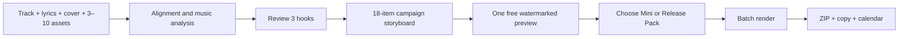
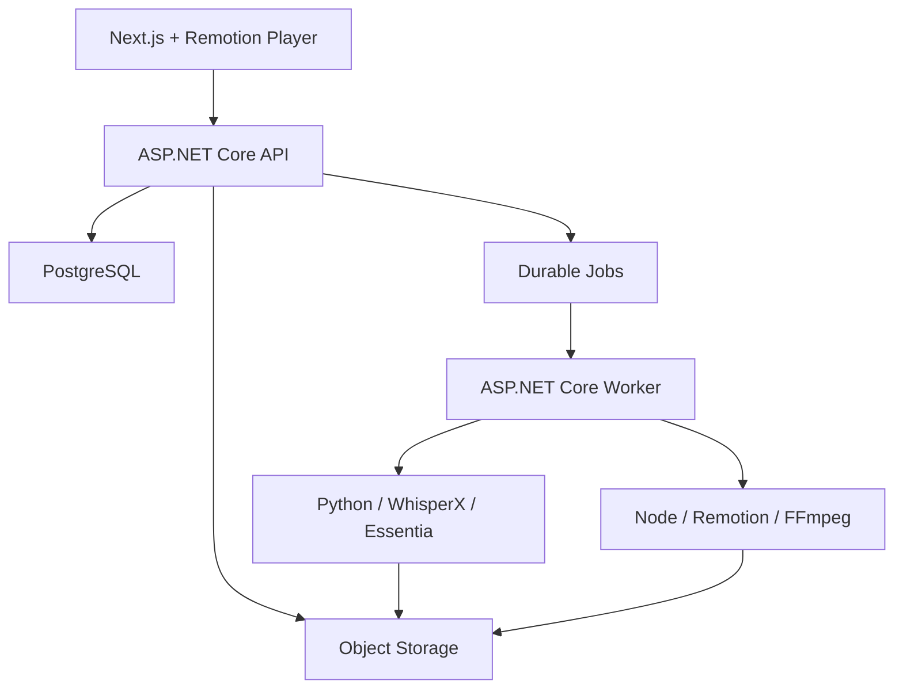

# Hook2Stream

## Продуктовый, бизнес- и технический план

> Версия: 3.0  
> Дата актуализации: 16 июля 2026 года  
> Статус: концепция утверждена; foundation и media-ingest MVP реализуются параллельно с concierge validation

---

## 1. Резюме

Hook2Stream — SaaS для независимых и AI-музыкантов, который превращает одну готовую песню в визуально согласованную 21-дневную кампанию коротких вертикальных видео.

Рабочий оффер:

> **One song. Three weeks of ready-to-post lyric shorts.**

Продуктовая единица — не отдельный клип и не абстрактные AI credits, а законченный `Release Pack`:

- ровно 18 вертикальных роликов длительностью 10–30 секунд;
- три музыкальных hook: припев, эмоциональная строка и инструментальный drop;
- синхронизированные lyrics;
- teaser, countdown и out-now материалы;
- platform-specific descriptions и CTA;
- календарь публикаций на 21 день;
- один ZIP для ручной загрузки в TikTok, YouTube Shorts, Instagram Reels и VK Clips.

Главная ценность:

- артисту не нужны концертные съёмки, backstage или постоянный поток нового видео;
- один небольшой набор assets превращается в разнообразную кампанию;
- ручная синхронизация текста и повторяющийся монтаж заменяются коротким review;
- пользователь покупает готовность к релизу, а не технологию генерации.

Вердикт: **GO**. Concierge validation остаётся коммерческим gate перед масштабированием analysis/render/billing, а ограниченный foundation и media-ingest срез уже реализуется для снижения технических рисков и подготовки demo packs.

---

## 2. Позиционирование

### 2.1. Job To Be Done

> Когда я выпускаю новую песню, я хочу один раз загрузить трек, lyrics и визуальный стиль и получить контент на три недели, чтобы регулярно публиковаться без монтажёра и второй работы в CapCut.

### 2.2. Основная аудитория

Первичный ICP:

- AI-группы;
- faceless-музыканты;
- исполнители, выпускающие музыку через Suno или Udio;
- домашние продюсеры;
- независимые артисты с релизом хотя бы раз в один-два месяца.

Общие признаки хорошего раннего клиента:

- есть финальный master, обложка и несколько визуальных материалов;
- нет постоянного видеографа или SMM-команды;
- short-form контент нужен регулярно;
- артист готов самостоятельно загружать готовые файлы на платформы;
- экономия двух и более часов на релиз имеет заметную ценность;
- следующий релиз ожидается в пределах 60 дней.

### 2.3. Вторичная аудитория

После подтверждения solo-сценария:

- небольшие музыкальные менеджеры;
- micro-labels;
- студии, которые помогают артистам с релизами;
- creator-команды с несколькими музыкальными проектами.

Командные роли, approvals и multi-brand billing не входят в MVP.

### 2.4. Кого не брать в MVP

- подкастеров и авторов вебинаров;
- блогеров без музыкального релиза;
- крупные лейблы с обязательным SLA;
- клиентов, которым нужна собственная text-to-video модель;
- агентства с white label;
- пользователей, ожидающих полностью автономную публикацию.

### 2.5. Обещание и ограничения

Hook2Stream обещает:

- скорость;
- повторяемый объём;
- единый визуальный язык;
- синхронизированные lyrics;
- готовые файлы и план.

Hook2Stream не обещает:

- вирусность;
- гарантированные стримы;
- автоматическое попадание в рекомендации;
- замену полной рекламной кампании;
- уникальные generative video scenes в базовой цене.

---

## 3. Почему здесь есть рынок

### 3.1. Фрагментированный текущий workflow

Музыканты уже платят за отдельные части релизного процесса:

| Продукт | Проверенный рыночный сигнал на 16 июля 2026 года | Что остаётся пользователю |
|---|---|---|
| [Feature.fm](https://feature.fm/pricing) | Artist plans стоят $8, $19 и $39 в месяц | Самостоятельно создавать short-form видео |
| [Freebeat](https://freebeat.ai/pricing) | Pro рекламируется за $26.99 вместо $34.99 в месяц; генерации расходуют credits | Управлять повторными генерациями и собирать кампанию |
| [Rotor Videos](https://rotorvideos.com/) | Canvas, artwork, music и lyric videos продаются за 1, 2, 3 и 4 credits; оплата при скачивании | Заказывать и организовывать отдельные видео |
| [PitchPlus](https://pitchplus.app/pricing) | Инструменты начинаются с $4.99; Viral Hook с вертикальным видео стоит $9.99 за песню | Превратить один hook в многодневную визуальную кампанию |

Рынок разделён между:

- smart links, pre-save и release intelligence;
- генерацией отдельного video asset;
- общими видеоредакторами;
- platform-native publishing tools.

Окно Hook2Stream находится между ними: **готовый, визуально согласованный пакет на весь релиз**.

Цены конкурентов являются snapshot, а не постоянной истиной. Их нужно повторно проверять перед публикацией сравнительных страниц.

### 3.2. Сигнал со стороны платформ

- TikTok сообщил о более чем 6 млрд сохранений треков через Add to Music App за период с апреля 2025 по апрель 2026 года: [TikTok Newsroom](https://newsroom.tiktok.com/tiktoks-add-to-music-app-surpasses-6-billion-track-saves-in-the-past-year?lang=en-GB).
- Spotify сообщает, что в 2025 году более трети артистов, заработавших на Spotify не менее $10 000, были DIY-артистами или начинали самостоятельно: [Spotify Loud & Clear](https://loudandclear.byspotify.com/takeaways/).

Эти цифры подтверждают важность short-form discovery и размер DIY-сегмента, но не доказывают спрос именно на Hook2Stream. Спрос подтверждают только платежи и повторные заказы.

### 3.3. Конкурентный клин

Hook2Stream отличается сочетанием пяти свойств:

1. Audio-first: продукт не требует готового музыкального клипа.
2. Music-aware: BPM, sections, energy и lyrics определяют монтажные границы.
3. Campaign-first: единицей результата являются 18 согласованных роликов.
4. Lyrics-first: phrase-level timing можно исправить до рендера.
5. Export-first: ценность не зависит от platform API, аудитов и OAuth.

---

## 4. Канонический продуктовый результат

### 4.1. Обязательные входы

Для запуска analysis пользователь предоставляет:

- один финальный MP3 или WAV;
- lyrics как текст или текстовый файл либо отмечает `Instrumental`;
- одну обложку;
- от 3 до 10 visual assets: изображения и/или короткие видео;
- имя артиста;
- название трека;
- язык;
- статус релиза и дату.

Поддерживаются два режима времени:

- `Upcoming` — известна будущая дата релиза;
- `Released` — трек уже выпущен, пользователь выбирает дату начала кампании.

### 4.2. Опциональный brand kit

- primary и secondary colors;
- accent color;
- heading и body fonts из поддерживаемого каталога;
- изображения персонажа или маскота;
- стандартные CTA;
- smart link;
- запрещённые слова или нежелательный tone.

Если значения не заданы:

- палитра извлекается из обложки;
- используются поддерживаемые default fonts;
- character layer отключается;
- CTA остаются редактируемыми defaults;
- пользователь видит defaults до генерации кампании.

### 4.3. Три hook

Каждый проект содержит три утверждённых hook:

1. `Chorus` — наиболее пригодный припев или повторяющаяся вокальная секция.
2. `EmotionalLyric` — законченная сильная строка или фраза.
3. `InstrumentalDrop` — drop, riff, solo, build-up payoff или максимальный energy transition.

Правила:

- каждый hook длится 10–30 секунд;
- начало и конец не обрывают слово без явного подтверждения пользователя;
- hook по возможности начинается на музыкальной границе;
- пользователь может изменить in/out или заменить предложенный участок;
- система показывает тип, timestamp, lyric excerpt и понятную причину выбора;
- если идеального кандидата нет, система предлагает лучший fallback и предупреждает о низкой уверенности;
- instrumental-трек всё равно получает три разных energy/structure hooks, но без выдуманных lyrics.

### 4.4. Фиксированный рецепт 18 роликов

#### 12 hook-вариантов

Для каждого из трёх hook создаются четыре композиции:

1. `KineticLyrics`;
2. `AnimatedCover`;
3. `VisualLoopA`;
4. `VisualLoopB`.

Итого: `3 hooks × 4 compositions = 12 videos`.

Для instrumental hook `KineticLyrics` становится beat-reactive title/CTA composition и не генерирует несуществующий текст.

#### 6 campaign-вариантов

- 2 `Teaser`;
- 2 `Countdown`;
- 2 `OutNow`.

Варианты одного типа должны отличаться как минимум opening, asset assignment или CTA, оставаясь в одном brand kit.

### 4.5. Семейства шаблонов

| Семейство | Назначение | Основные controls |
|---|---|---|
| Kinetic Lyrics | Главный lyric-first формат | Phrase timing, text position, font, line breaks, highlight style |
| Animated Cover | Работа даже при минимуме video assets | Cover motion, depth, particles, waveform, title treatment |
| Visual Loop | Повторное использование изображений и видео | Asset, fit/fill, focal point, loop mode, overlays |
| Campaign Card | Teaser, countdown и out-now | Phase, date, title, CTA, background asset |

Это template-driven generation. Собственная text-to-video модель в MVP отсутствует.

### 4.6. Календарь 10/1/10

Для будущего релиза кампания занимает 21 календарный день:

| Фаза | Дни | Количество |
|---|---|---:|
| Pre-release | `-10, -9, -8, -6, -5, -3, -2, -1` | 8 |
| Release day | `0`, два рекомендованных time slots | 2 |
| Post-release | `+1, +2, +3, +5, +6, +7, +9, +10` | 8 |

Итого: 18 campaign items внутри окна от `-10` до `+10`.

Для уже выпущенного трека:

- день `0` — выбранная дата начала;
- используются 18 слотов внутри следующих 21 календарных дней;
- countdown items заменяются дополнительными post-release hook/CTA variants;
- copy не создаёт ложное впечатление, что релиз ещё не состоялся.

### 4.7. Copy и destinations

Для каждого campaign item генерируются:

- neutral description;
- эмоциональный short caption;
- CTA;
- hashtags;
- варианты текста для TikTok, YouTube Shorts, Instagram Reels и VK Clips.

Один video MP4 остаётся platform-neutral. ZIP не дублирует один и тот же MP4 четыре раза.

---

## 5. Пользовательский сценарий



1. Посетитель видит оффер и реальные examples.
2. Пользователь регистрируется и создаёт персональный workspace.
3. Создаёт release project и указывает release timing.
4. Загружает audio, lyrics, cover и 3–10 visual assets.
5. При необходимости настраивает brand kit.
6. Подтверждает права на загруженные материалы и synthetic-content status.
7. Система нормализует media и запускает WhisperX/Essentia analysis.
8. Пользователь проверяет phrase alignment и три hook.
9. Система формирует 18-item storyboard, copy и календарь.
10. Пользователь может заменить asset, template, opening или CTA отдельного item.
11. Система рендерит один лучший low-resolution preview с watermark.
12. Пользователь покупает Mini Release, Release Pack или использует entitlement подписки.
13. Paid items рендерятся в 1080×1920.
14. Пользователь скачивает ZIP и вручную публикует материалы.

Основной self-service сценарий должен быть понятен без звонка с основателем.

---

## 6. UX

### 6.1. Визуальный образ

Hook2Stream выглядит как спокойная музыкальная release workstation:

- тёмный нейтральный фон;
- waveform и song sections как главный визуальный мотив;
- ролики и обложка важнее декоративного AI-оформления;
- понятные стадии вместо бесконечного spinner;
- минимум glow, сложных градиентов и технического жаргона.

Рекомендуемые tokens:

- background `#0B0D12`;
- surface `#151923`;
- primary `#7C5CFF`;
- success `#24C8A5`;
- warning `#FFB454`;
- error `#FF5D73`;
- main text `#F4F6FA`;
- secondary text `#A7AFBF`.

### 6.2. Landing

Первый экран:

> **One song. Three weeks of ready-to-post lyric shorts.**

Подзаголовок:

> Upload your track, lyrics and a few visuals. Get 18 on-brand videos, captions and a 21-day posting calendar.

Основное действие — `Create your release pack`.

Ниже:

- один исходный track/brand kit;
- три hooks;
- сетка 18 results;
- примеры teaser, lyrics, loop и out-now;
- сравнение ручного workflow и Hook2Stream;
- тарифы;
- отсутствие обещаний вирусности.

### 6.3. Dashboard

- `New release` как primary action;
- recent release projects;
- status и progress;
- число готовых items;
- доступный entitlement;
- история ZIP;
- first-run example вместо пустой таблицы.

### 6.4. Create Release

Четыре коротких шага:

1. Track и release information.
2. Lyrics и rights.
3. Cover и visual assets.
4. Brand kit и подтверждение запуска.

До analysis система показывает:

- обязательные отсутствующие данные;
- upload limits;
- число assets;
- ожидаемый результат: 18-item campaign;
- что будет доступно бесплатно.

### 6.5. Alignment and Hook Review

Экран содержит:

- waveform;
- phrase timings;
- song sections;
- BPM;
- три hook cards;
- in/out handles;
- confidence и warnings;
- действие replace hook.

Полноценного multi-track timeline нет.

### 6.6. Campaign Storyboard

Основной экран результата — сетка из 18 карточек.

Карточка показывает:

- campaign day;
- phase;
- hook;
- template;
- duration;
- visual asset;
- lyric/title excerpt;
- CTA;
- preview state;
- edit и regenerate.

Изменение одной карточки не должно незаметно изменять остальные утверждённые items.

### 6.7. Preview and Checkout

До оплаты:

- один лучший item доступен как полный low-resolution video preview с watermark;
- остальные 17 показываются storyboard-карточками;
- пользователь видит состав Mini и Release Pack;
- checkout не маскирует подписку под разовую покупку.

После оплаты:

- Mini позволяет выбрать любые 6 items; по умолчанию предложены top-6;
- Release Pack открывает все 18;
- Active Artist использует один Release Pack entitlement текущего billing period.

### 6.8. Render and Download

- общий прогресс и статус каждого item;
- успешные items доступны при partial failure;
- retry только для неуспешных items;
- ZIP появляется после готовности разрешённого набора;
- история сохраняет manifest и immutable render versions.

---

## 7. Граница MVP

### 7.1. Входит

- public landing;
- managed auth и персональный workspace;
- release projects и history;
- MP3/WAV, lyrics, cover и 3–10 visual assets;
- rights declaration и synthetic-content flag;
- brand kit с безопасными defaults;
- WhisperX phrase/word alignment;
- Essentia BPM, beat, structure и energy analysis;
- три editable hooks;
- фиксированный campaign recipe на 18 items;
- четыре template families;
- campaign storyboard и item-level controls;
- descriptions, CTA и 21-day calendar;
- один watermarked preview;
- Mini/Release/Active Artist checkout;
- batch render 1080×1920;
- ZIP, CSV, ICS и manifest;
- durable jobs, retry, idempotency, cost telemetry и deletion.

### 7.2. Не входит

- собственная text-to-video модель;
- generative backgrounds в базовом пакете;
- автоматическая публикация;
- social OAuth;
- Spotify analytics;
- ad management;
- десять platform-specific video encodes;
- multi-track editor;
- arbitrary transitions/effects timeline;
- команды, роли и approvals;
- multi-brand workspace;
- white label;
- public API и outgoing webhooks;
- mobile app.

### 7.3. Definition of Done

MVP готов к платной beta, когда:

- новый пользователь самостоятельно проходит от регистрации до ZIP;
- типовой трек до пяти минут получает analysis и storyboard без ручной работы оператора;
- пользователь может исправить lyrics timing и каждый hook;
- campaign plan всегда содержит ровно 18 валидных items;
- один бесплатный preview содержит watermark, paid outputs его не содержат;
- Mini экспортирует ровно шесть выбранных items;
- Release Pack экспортирует все 18;
- каждый paid output проходит ffprobe validation;
- restart worker не создаёт дубликат результата или списания;
- failure одного render не уничтожает остальные;
- пользователь может удалить проект и assets;
- минимум пять пилотных клиентов оплатили, опубликовали результаты и подтвердили экономию не менее двух часов.

---

## 8. Техническая архитектура

### 8.1. Компоненты

- Next.js/React web application;
- Remotion Player для browser preview;
- ASP.NET Core API;
- ASP.NET Core orchestration worker;
- Node.js Remotion render worker;
- Python-sidecar с WhisperX и Essentia;
- PostgreSQL;
- durable PostgreSQL-backed job queue;
- S3-compatible object storage;
- FFmpeg/ffprobe;
- Server-Sent Events;
- .NET Aspire для local orchestration;
- OpenTelemetry и structured logs.



### 8.2. Основные сущности

- `User`, `Workspace`;
- `BrandKit`, `BrandKitSnapshot`;
- `ReleaseProject`, `ReleaseTiming`;
- `AudioAsset`, `CoverAsset`, `VisualAsset`, `DerivedAsset`;
- `LyricsDocument`, `PhraseTiming`;
- `SongAnalysis`, `SongSection`, `EnergyEvent`;
- `HookVariant`;
- `CampaignPlan`, `CampaignItem`;
- `CompositionSpec`, `RenderVersion`;
- `ExportBundle`;
- `Product`, `Purchase`, `Subscription`, `Entitlement`;
- `UsageTransaction`, `Job`, `AuditEvent`.

### 8.3. Versioned contracts

`SongAnalysis` содержит:

- analysis version;
- source asset hash;
- BPM и beat grid;
- sections;
- phrase/word timings;
- energy/transition events;
- warnings и confidence.

`CampaignItem` содержит:

- campaign day и phase;
- hook ID;
- template ID/version;
- visual asset IDs;
- composition controls;
- lyric/title payload;
- copy variants и CTA;
- duration;
- status.

`CompositionSpec` является единственным контрактом preview и final render. Финальный `RenderVersion` immutable и включает hashes всех входов.

### 8.4. Состояния

Project:

```text
Draft
→ Analyzing
→ HookReview
→ CampaignReady
→ PreviewReady
→ Rendering
→ Ready | PartiallyReady
→ Archived
```

Job:

```text
Queued → Running → Succeeded | Failed | Cancelled
```

Project state не заменяет состояния отдельных jobs и campaign items.

### 8.5. Pipeline

1. Создать release project.
2. Загрузить assets напрямую в object storage.
3. Проверить limits, MIME, container и codecs.
4. Нормализовать audio и visual proxies.
5. Вычислить audio hash и analysis version.
6. Выполнить WhisperX alignment.
7. Выполнить Essentia analysis.
8. Сформировать три hook suggestions.
9. Зафиксировать пользовательские corrections.
10. Создать versioned 18-item `CampaignPlan`.
11. Сгенерировать copy и calendar.
12. Render одного preview.
13. Активировать entitlement после checkout.
14. Render разрешённых paid items.
15. Провести ffprobe validation.
16. Собрать ZIP, CSV, ICS и manifest.
17. Записать фактическое usage и освободить reservations.

### 8.6. Надёжность и безопасность

Измеримые SLO, processing targets, production topology, media profiles, retention, security controls, accessibility и browser support зафиксированы в [нефункциональных требованиях](../non-func-requirements/README.md).

- presigned upload/download URLs;
- server-generated object keys;
- workspace isolation на каждом запросе;
- process limits и timeouts;
- FFmpeg без shell interpolation;
- allowlist fonts и templates;
- durable retry с idempotency key;
- composition hash deduplication;
- signed billing webhooks;
- immutable usage ledger;
- configurable retention;
- немедленная logical deletion и асинхронное physical deletion;
- audit для admin retry, refund и manual entitlement.

### 8.7. Тестовая стратегия

Verification suites должны ссылаться на соответствующие `FR-*` и `NFR-*`.

- unit tests для recipe, schedule, pricing и state transitions;
- integration tests с PostgreSQL и S3-compatible storage;
- contract tests между .NET, Python и Node;
- golden corpus минимум из 20 лицензированных tracks;
- русский, английский и instrumental fixtures;
- mixed assets: portrait, landscape, still, short loop, missing character;
- phrase alignment и manual correction tests;
- representative-frame snapshots;
- audio/video sync checks;
- ffprobe output validation;
- restart, retry, cancellation и duplicate delivery;
- Playwright: signup → upload → hooks → storyboard → preview → checkout → ZIP.

---

## 9. Монетизация

### 9.1. Продукты

| Product | Цена | Entitlement |
|---|---:|---|
| Preview | $0 | Один low-resolution watermarked preview |
| Mini Release | $19 one-time | Любые 6 clean campaign items |
| Release Pack | $39 one-time | Все 18 clean items, copy и calendar |
| Active Artist | $29/month | Один Release Pack в billing period, brand kit и history |

Правила:

- неиспользованный monthly pack не переносится;
- разовая покупка не запускает подписку;
- пользователь явно выбирает шесть Mini items;
- top-6 предлагается только как default;
- paid output не содержит сервисный watermark;
- повторный render неизменённой composition переиспользует готовый asset;
- generative backgrounds отключены в MVP и позднее получают отдельный credit ledger.

### 9.2. Revenue scenarios

Только Active Artist:

| Подписчики | MRR |
|---:|---:|
| 50 | $1,450 |
| 200 | $5,800 |
| 500 | $14,500 |

Разовые Mini и Release Pack добавляются сверх подписочного MRR.

### 9.3. Unit economics

Измеряемые variable units:

- analysed audio seconds;
- WhisperX GPU/CPU seconds;
- rendered output seconds;
- storage byte-days;
- delivery bytes;
- LLM calls/tokens;
- retries;
- variable support time.

Guardrails после появления реальных данных:

- direct compute не более 15% net revenue;
- contribution margin не менее 70%;
- hard limits на source duration, concurrency и retries;
- отдельная экономика для generative video.

---

## 10. Concierge validation до SaaS

### 10.1. Подготовка

1. Сделать три демонстрационных Release Pack на треках NEЯСЫТЬ.
2. Собрать англоязычный landing.
3. Подготовить intake form, rights attestation и delivery template.
4. Зафиксировать ручное время по стадиям.
5. Сформировать before/after case study без обещаний роста просмотров.

### 10.2. Продажи

- не предлагать бесплатную beta как основной оффер;
- стартовый pilot — $19;
- найти 30 релевантных артистов в Suno/Udio Discord, Reddit и indie communities;
- выполнять первые заказы полуавтоматически;
- наблюдать, какие items реально публикуются;
- просить следующий заказ, а не только отзыв.

### 10.3. Критерий продолжения

Self-service разработка получает GO, если:

- есть минимум 5 оплат;
- большинство клиентов публикуют полученные материалы;
- минимум 2–3 клиента хотят заказать следующий релиз;
- экономия составляет не менее двух часов на клиента;
- ручное производство одного Pack укладывается в приемлемую себестоимость;
- пользователи понимают ценность формулировки «three weeks of content».

Если оплат нет, сначала меняется оффер, ICP или delivery format, а не наращивается функциональность.

---

## 11. План MVP на 4–6 недель

Оценка предполагает:

- одного разработчика с сильным .NET backend;
- managed auth и hosted checkout;
- готовые UI primitives;
- ограниченные template controls;
- отсутствие social integrations и generative video;
- использование WhisperX, Essentia, Remotion и FFmpeg без обучения собственной модели.

### Неделя 1 — foundation и ingest

- Next.js, API, workers и Aspire;
- PostgreSQL и object storage;
- auth/workspace;
- release project;
- MP3/WAV, cover и visual upload;
- validation и proxies.

### Неделя 2 — lyrics и music analysis

- lyrics document;
- WhisperX alignment;
- phrase editor;
- Essentia BPM, sections и energy;
- analysis progress и retry;
- initial hook selection.

### Неделя 3 — hooks и campaign plan

- Hook Review;
- manual in/out и replace;
- deterministic 18-item recipe;
- 10/1/10 schedule;
- released-track adaptation;
- copy/CTA drafts.

### Неделя 4 — compositions и preview

- четыре template families;
- Remotion Player;
- shared `CompositionSpec`;
- fit/fill/focal point;
- lyrics styles;
- one watermarked preview.

### Неделя 5 — paid render и export

- checkout и entitlements;
- Mini selection;
- batch Remotion render;
- FFmpeg/ffprobe validation;
- ZIP, CSV, ICS и manifest;
- history и secure download.

### Неделя 6 — hardening и pilot

- golden corpus;
- idempotency/restart tests;
- partial failure UX;
- cost telemetry;
- deletion/retention;
- Playwright happy path;
- первые self-service pilots.

Если media edge cases занимают больше времени, scope сохраняется, а beta переносится: social publishing или editor features не добавляются вместо hardening.

---

## 12. Метрики

### 12.1. North Star

**Published Release Packs** — оплаченные кампании, из которых артист реально опубликовал не менее шести items.

Число сгенерированных роликов само по себе не является ценностью.

### 12.2. Product metrics

| Категория | Метрика | Ранняя гипотеза |
|---|---|---:|
| Activation | Signup → valid project | ≥ 50% |
| Pipeline | Valid project → storyboard | ≥ 85% |
| Time to value | P50 upload complete → storyboard | ≤ 10 минут для типового трека |
| Alignment | Projects без ручной правки большинства phrases | ≥ 70% |
| Hook quality | Hooks accepted с малыми правками | ≥ 50% |
| Preview | Storyboard → preview watched | ≥ 60% |
| Conversion | Qualified preview → paid product | измерить на пилотах |
| Reliability | Paid render success | > 97% после стабилизации |
| Value | Экономия времени по self-report | ≥ 2 часов |
| Retention | Следующий платный релиз за 60 дней | ≥ 30% |

### 12.3. Cost metrics

- cost per analysed track;
- cost per preview;
- cost per paid item;
- retries per campaign;
- storage and delivery per campaign;
- support minutes per campaign;
- contribution margin по каждому product.

---

## 13. Основные риски

| Риск | Снижение |
|---|---|
| 18 роликов выглядят слишком похожими | Фиксированный mix templates, три hooks, asset rotation и storyboard review |
| Lyrics alignment ошибается на вокале | Пользовательский текст как source, phrase-level confidence и быстрый editor |
| Не находится instrumental drop | Fallback по energy/structure с warning и ручной replace |
| У пользователя слабые visual assets | Animated cover, fit/blur defaults и понятные требования к 3–10 assets |
| Повторные render уничтожают маржу | Preview low-res, composition hash dedup, limits и telemetry |
| Подписка churn между релизами | Разовые Mini/Release Pack и ориентация на артистов с частыми релизами |
| Пользователи хотят editor вместо результата | Ограничить controls и измерять причины item rejection |
| Автопубликация отвлекает от core value | Export-first scope и отсутствие social OAuth в MVP |
| Generative video создаёт непредсказуемые расходы | Не включать в MVP; позднее отдельные credits |
| Название конфликтует с чужим брендом | До коммерческого launch отдельно проверить trademark и domain |

---

## 14. Итоговая формулировка

> **Hook2Stream turns one song, its lyrics and a handful of visuals into 18 on-brand short videos and a ready-to-use 21-day release calendar.**

Первая задача продукта — доказать, что независимые артисты готовы регулярно платить за готовую кампанию и действительно публикуют её материалы. Расширение в сторону других creator-ниш возможно только после того, как музыкальный wedge подтвердит повторяемый спрос.
