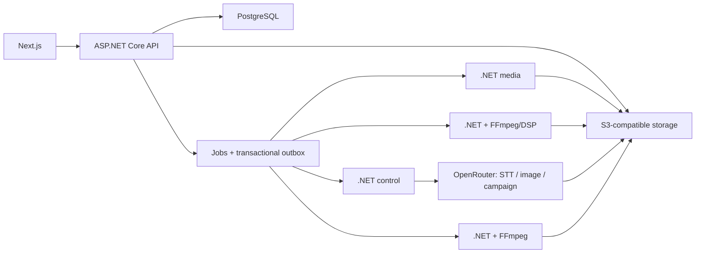

# Технологический стек Hook2Stream

Источник: [Hook2Stream Product Plan](Hook2Stream_Product_Plan.md), раздел «Техническая архитектура».

## MVP

| Категория | Технология | Роль |
|---|---|---|
| Web UI | Next.js, React, TypeScript | Landing, onboarding, hook review, campaign storyboard, billing и downloads |
| Browser preview | HTML5 media + versioned composition controls | Предпросмотр утверждённого hook и той же composition spec, которая используется финальным renderer |
| Backend API | ASP.NET Core | REST API, авторизация, доменная логика, entitlements и orchestration |
| Control worker | ASP.NET Core Worker | Reconcile-loop, revision gates, outbox dispatch, provider manifests, billing/export orchestration |
| Media worker | ASP.NET Core Worker + FFmpeg/ffprobe | Ingest, validation, lossless analysis derivative и browser-safe proxies |
| Render worker | ASP.NET Core Worker + FFmpeg/ffprobe | Детерминированный template render, media normalization, muxing и output validation без neural models |
| Music analysis | ASP.NET Core Worker + FFmpeg/DSP | Детерминированные BPM, beats, sections и energy без локальных model weights |
| Архитектура | Модульный монолит + изолированные workers | Простое развитие домена при отдельном масштабировании тяжёлых media jobs |
| Локальная оркестрация | .NET Aspire AppHost + ServiceDefaults | API, workers, PostgreSQL, object storage, health checks, telemetry и dev dashboard |
| База данных | PostgreSQL | Source of truth, состояния jobs, campaign plans, billing и audit |
| Очередь | Capability-routed PostgreSQL queue + transactional outbox | Персистентные команды с lease fencing, retry, reconciliation и idempotency |
| Object storage | S3-compatible storage, например Cloudflare R2 | Originals, normalized assets, previews, renders и export bundles |
| Realtime progress | Project Server-Sent Events + polling snapshot | Ordered events с `Last-Event-ID` для upload/analysis/review/render/export и reload-safe fallback |
| Auth | Managed authentication | Регистрация, вход, восстановление и персональный workspace |
| Billing | Stripe-hosted Checkout + signed webhooks | Cover/video purchases, подписка, artwork generation balance, refunds и entitlement activation |
| AI gateway | OpenRouter с обязательным Zero Data Retention | Единственная внешняя точка для transcription, artwork и campaign/copy; прямые provider API запрещены |
| AI transcription | `openai/whisper-large-v3` через OpenRouter | RU/EN phrase/word transcription из MP3 после явного consent |
| AI artwork | `bytedance-seed/seedream-4.5` через OpenRouter | Три text-free cover candidates и три backgrounds; typography выполняется детерминированно |
| AI campaign/copy | `openai/gpt-oss-120b` через OpenRouter | Структурированный 18-item plan, descriptions и CTA из утверждённых revisions |
| Observability | OpenTelemetry, structured logs, error tracking | Trace от пользовательской операции до analysis/render jobs |
| Testing | Unit, integration, golden media corpus, Playwright | Доменная логика, media pipeline и основной пользовательский сценарий |

## Текущий implementation snapshot

Реализованный первый срез использует:

- .NET 10 modular monolith: Domain, Application, Infrastructure, API, Worker и Bootstrapper;
- .NET Aspire AppHost/ServiceDefaults с PostgreSQL, MinIO, health checks и OpenTelemetry;
- EF Core migrations и PostgreSQL-backed durable queue с lease/retry;
- MP3-first domain/API contracts, immutable transcript/artwork/hook/campaign revisions и workflow lanes;
- transactional outbox/inbox, capability-filtered jobs и lease fencing;
- S3-compatible direct single/multipart upload;
- FFmpeg/ffprobe ingest для audio, image и video derivatives;
- Google OAuth + собственный JWT validation и персональный workspace;
- Next.js App Router, React, TypeScript, Tailwind и Playwright;
- build-time OpenAPI generation и `openapi-typescript` для frontend contracts;
- deterministic fixture adapters для tests, OpenRouter adapters для AI stages и deterministic analysis/render providers.

Fixtures проверяют orchestration и contracts, но не считаются production AI. Production не требует локальных neural-model containers: нужны OpenRouter ZDR credentials, FFmpeg, Stripe billing, object storage и export assembler.

## Границы компонентов

- API не обрабатывает тяжёлые media-файлы в request process.
- OpenRouter adapters работают только после актуального rights/processing consent и требуют ZDR/data-collection guardrails.
- Транскрипция отправляет audio bytes через OpenRouter; artwork/campaign получают минимально необходимый approved context. Signed URLs и provider credentials никогда не входят в prompt.
- Production analysis и render выполняются детерминированно через FFmpeg/DSP; локальные нейросети, Python/CUDA sidecars и generative-video endpoints отсутствуют.
- Browser preview и server render используют один `CompositionSpec`; платформенные различия хранятся в copy, а не в дубликатах MP4.
- PostgreSQL является единственным source of truth для состояния операций. Object storage хранит bytes, но не определяет бизнес-состояние.

## Не включать в MVP

| Технология или интеграция | Причина |
|---|---|
| Kubernetes | Нет измеренной необходимости для первых платных кампаний |
| Redis как обязательная зависимость | Durable jobs, outbox и locks работают на PostgreSQL; Redis можно добавить после измерений |
| Social platform OAuth/API | Export-first запуск быстрее и не зависит от внешних аудитов |
| Собственная text-to-video модель | Высокая стоимость, риск маржи и отсутствие необходимости для основного результата |
| Полноценный NLE/editor | MVP ограничивается hook timing, asset selection, fit/fill, focal point и style controls |
| Public API/webhooks | Доменная модель должна стабилизироваться на self-service workflow |

## Возможные дополнения после валидации

- text-to-video scenes за отдельную проверку экономики и безопасности;
- reusable campaign presets и несколько brand kits;
- TikTok/YouTube upload после отдельной проверки API и аудита;
- mobile review;
- performance analytics и recommendation loop;
- Redis для cache или high-contention locks, если это подтвердят метрики.
