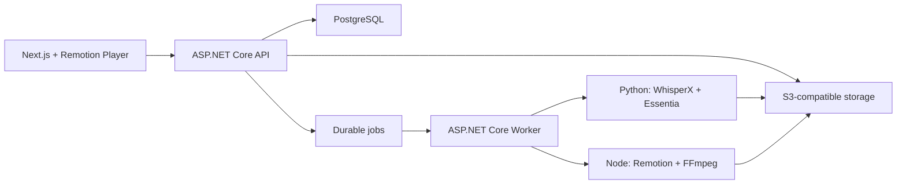

# Технологический стек Hook2Stream

Источник: [Hook2Stream Product Plan](Hook2Stream_Product_Plan.md), раздел «Техническая архитектура».

## MVP

| Категория | Технология | Роль |
|---|---|---|
| Web UI | Next.js, React, TypeScript | Landing, onboarding, hook review, campaign storyboard, billing и downloads |
| Browser preview | Remotion Player | Предпросмотр той же versioned composition, которая используется финальным renderer |
| Backend API | ASP.NET Core | REST API, авторизация, доменная логика, entitlements и orchestration |
| Application worker | ASP.NET Core Worker | Durable workflows, анализ, render orchestration, export и cleanup |
| Render worker | Node.js, Remotion, FFmpeg/ffprobe | Серверный render, media normalization, muxing и output validation |
| Analysis sidecar | Python, WhisperX, Essentia | Phrase/word alignment, BPM, beat grid, sections, energy и transition features |
| Архитектура | Модульный монолит + изолированные workers | Простое развитие домена при отдельном масштабировании тяжёлых media jobs |
| Локальная оркестрация | .NET Aspire AppHost + ServiceDefaults | API, workers, PostgreSQL, object storage, health checks, telemetry и dev dashboard |
| База данных | PostgreSQL | Source of truth, состояния jobs, campaign plans, billing и audit |
| Очередь | Durable PostgreSQL-backed job queue | Персистентные команды с retry, cancellation и idempotency |
| Object storage | S3-compatible storage, например Cloudflare R2 | Originals, normalized assets, previews, renders и export bundles |
| Realtime progress | Server-Sent Events | Однонаправленный прогресс upload, analysis, render и export |
| Auth | Managed authentication | Регистрация, вход, восстановление и персональный workspace |
| Billing | Hosted checkout + signed webhooks | Разовые покупки, подписка, refunds и entitlement activation |
| AI copy | LLM adapter | Platform-specific descriptions и CTA из утверждённых campaign items |
| Observability | OpenTelemetry, structured logs, error tracking | Trace от пользовательской операции до analysis/render jobs |
| Testing | Unit, integration, golden media corpus, Playwright | Доменная логика, media pipeline и основной пользовательский сценарий |

## Границы компонентов

- API не обрабатывает тяжёлые media-файлы в request process.
- Python-sidecar принимает object-storage references и возвращает versioned `SongAnalysis`.
- Browser preview и server render используют один `CompositionSpec`; платформенные различия хранятся в copy, а не в дубликатах MP4.
- PostgreSQL является единственным source of truth для состояния операций. Object storage хранит bytes, но не определяет бизнес-состояние.

## Не включать в MVP

| Технология или интеграция | Причина |
|---|---|
| Kubernetes | Нет измеренной необходимости для первых платных кампаний |
| Redis как обязательная зависимость | Durable jobs и locks должны работать на PostgreSQL; Redis можно добавить после измерений |
| Social platform OAuth/API | Export-first запуск быстрее и не зависит от внешних аудитов |
| Собственная text-to-video модель | Высокая стоимость, риск маржи и отсутствие необходимости для основного результата |
| Полноценный NLE/editor | MVP ограничивается hook timing, asset selection, fit/fill, focal point и style controls |
| Public API/webhooks | Доменная модель должна стабилизироваться на self-service workflow |

## Возможные дополнения после валидации

- generative backgrounds за отдельные credits;
- reusable campaign presets и несколько brand kits;
- TikTok/YouTube upload после отдельной проверки API и аудита;
- mobile review;
- performance analytics и recommendation loop;
- Redis для cache или high-contention locks, если это подтвердят метрики.
