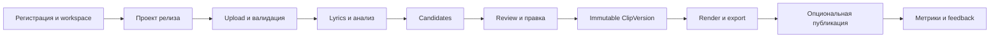

# Функциональные требования ClipForge

> Статус: проект спецификации  
> Версия: 1.0  
> Дата: 14 июля 2026 года  
> Основной источник: [AI Content Factory for Musicians](../base/AI_Content_Factory_SaaS_Plan.md)

## 1. Назначение и охват

Этот комплект преобразует продуктовый план ClipForge в атомарные, трассируемые и проверяемые функциональные требования. Он описывает весь утверждённый roadmap, но не смешивает будущие возможности с обязательствами первой версии:

| Метка | Значение |
|---|---|
| `P0 / Core MVP` | Обязательно для платной self-service beta с основным сценарием `upload → candidates → edit → render → export` |
| `P1 / V1` | Публичный продукт после подтверждения ценности Core MVP |
| `P1 gated` | Реализация и доступность зависят от внешнего аудита, допуска или compliance-проверки |
| `P1 spike` | Исследовательская реализация; пользовательская функция не обещается до прохождения критериев spike |
| `P2 / V2` | Командная работа, масштабирование и learning loop после подтверждения спроса |
| `Later` | Зафиксированное направление, не входящее в обязательства P0–P2 |

Принята стратегия `Global English-first`: после export-first Core MVP приоритет имеют YouTube, TikTok Upload и затем Instagram. TikTok Direct Post остаётся gated-функцией, VK — условным spike/fallback. Перед реализацией каждой платформенной интеграции ограничения должны быть повторно проверены по официальной документации; сведения базового плана актуальны на 9 июля 2026 года.

Отдельное осознанное уточнение roadmap: минимальный адаптивный mobile web subset — просмотр job/candidate, `Select`/`Reject` и download — ускорен до P0, чтобы основной review/export сценарий не требовал desktop. Это не включает полноценный mobile Clip Editor или нативное приложение и не подменяет более широкий Mobile review epic P1 из базового плана.

## 2. Нормативные соглашения

### 2.1. Идентификаторы

Требования имеют формат `FR-<DOMAIN>-NNN`. Этап не входит в идентификатор: требование может перейти между релизами без смены ID.

| Код | Область |
|---|---|
| `ACC` | Аккаунт, workspace, onboarding и команды |
| `PRJ` | Проекты релиза и media assets |
| `RGT` | Права и compliance |
| `LYR` | Lyrics, transcript и тайминги |
| `ANL` | Анализ и кандидаты |
| `EDT` | Candidate Review и Clip Editor |
| `EXP` | Copy, render и export |
| `PUB` | Социальные интеграции, календарь и публикация |
| `MET` | Аналитика и learning loop |
| `BIL` | Usage, entitlements и billing |
| `ADM` | Support и администрирование |

Идентификаторы не перенумеровываются и не переиспользуются. Критерии приёмки обозначаются локально как `AC-01`, `AC-02`; полная ссылка имеет вид `FR-PRJ-001/AC-01`.

### 2.2. Шаблон требования

Каждое требование содержит:

1. этап и условность;
2. актора;
3. ссылку на основание в базовом плане;
4. нормативную формулировку «Система должна…»;
5. правила и предусловия, если они нужны для однозначной реализации;
6. проверяемые критерии в формате «Дано / Когда / Тогда»;
7. ссылки на связанные требования, когда без них теряется контекст.

Термины `должна`, `не должна` и `только` нормативны. Описания мотивации, KPI и бизнес-гипотезы нормативными требованиями не являются.

### 2.3. Неизвестные значения

Числовые и продуктовые политики, которых нет в базовом плане, не придумываются. Требования ссылаются на именованные параметры `CFG-*`, а решение о конкретном значении фиксируется в [реестре открытых решений](#8-реестр-открытых-решений).

Проверка такого требования выполняется относительно активной конфигурации: значение непосредственно ниже границы принимается, значение выше границы отклоняется, а пользователь видит применённую границу до расходования лимита.

## 3. Акторы

| Актор | Назначение |
|---|---|
| Посетитель | Просматривает публичную информацию и начинает регистрацию |
| Пользователь | Создаёт и обрабатывает собственные release campaigns |
| Владелец workspace (`Owner`) | Управляет workspace, участниками, политиками и оплатой |
| `Editor` | Редактирует проекты и клипы без права публикации |
| `Reviewer` | Согласовывает или возвращает версии на доработку |
| `Publisher` | Отправляет только разрешённые версии на внешние платформы |
| Внешний рецензент | Просматривает предоставленную версию по защищённой ссылке без доступа к workspace |
| Правообладатель / заявитель | Инициирует takedown-разбирательство |
| Сотрудник поддержки | Получает минимальный диагностический контекст и помогает восстановить операцию |
| Администратор | Выполняет разрешённые retry, credit/refund и другие аудируемые операции |
| Платёжный провайдер | Передаёт события оплаты, возврата и отмены |
| Социальная платформа | Принимает upload/publication и возвращает состояние обработки |
| Внешний API-клиент | Вызывает включённый публичный API от имени авторизованного workspace и принимает его versioned contracts |
| Фоновый обработчик | Выполняет durable analysis/render/publication jobs от имени системы |
| Система | Выполняет автоматические проверки, расчёты и переходы состояний; формулировки «Система анализа» и «Фоновый обработчик» обозначают профильные подсистемы этого актора |
| Участник workspace | Обобщающее обозначение текущего авторизованного пользователя workspace; конкретные полномочия определяются ролью `Owner`, `Editor`, `Reviewer` или `Publisher` |

Формулировка «Пользователь workspace» является синонимом «Участник workspace». В Core MVP пользователь является единственным владельцем персонального workspace. Командные роли и внешний review появляются в P2.

## 4. Карта документов

| Документ | Требования | Основные источники |
|---|---|---|
| [Аккаунт и workspace](01-account-and-workspace.md) | `FR-ACC-*` | §5, §6.1, §8.3–8.5 |
| [Проекты релиза и media](02-release-projects-and-media.md) | `FR-PRJ-*` | §5, §6.2, §8.4–8.6, §9.3–9.4 |
| [Права, lyrics и compliance](03-rights-lyrics-and-compliance.md) | `FR-RGT-*`, `FR-LYR-*` | §4, §6.3, §9.4 |
| [Анализ контента](04-content-analysis.md) | `FR-ANL-*` | §6.4, §9.5 |
| [Review и Clip Editor](05-candidate-review-and-clip-editor.md) | `FR-EDT-*` | §6.5, §8.7–8.8 |
| [Copy, render и export](06-copy-render-and-export.md) | `FR-EXP-*` | §6.6, §8.9, §9.4 |
| [Интеграции и публикация](07-social-integrations-and-publication.md) | `FR-PUB-*` | §4, §6.7, §10.3 |
| [Аналитика и learning loop](08-analytics-and-learning-loop.md) | `FR-MET-*` | §6.8, §12 |
| [Billing, support и admin](09-billing-support-and-administration.md) | `FR-BIL-*`, `FR-ADM-*` | §6.9, §9.6, §11 |

Каждое требование содержит собственную ссылку на точный раздел источника. Поэтому эта карта дополняет, но не заменяет трассировку на уровне FR.

### 4.1. Сводный реестр требований

Количество требований в реестре: 201. Точная трассировка на исходный план и критерии приёмки находятся в карточке каждого FR.

| ID | Требование | Этап | Документ |
|---|---|---|---|
| `FR-ACC-001` | Регистрация пользователя | `P0 / Core MVP` | [01](01-account-and-workspace.md) |
| `FR-ACC-002` | Вход в аккаунт | `P0 / Core MVP` | [01](01-account-and-workspace.md) |
| `FR-ACC-003` | Восстановление доступа | `P0 / Core MVP` | [01](01-account-and-workspace.md) |
| `FR-ACC-004` | Принятие Terms и Privacy | `P0 / Core MVP` | [01](01-account-and-workspace.md) |
| `FR-ACC-005` | Персональный workspace | `P0 / Core MVP` | [01](01-account-and-workspace.md) |
| `FR-ACC-006` | Изоляция данных workspace | `P0 / Core MVP` | [01](01-account-and-workspace.md) |
| `FR-ACC-007` | Сбор предпочтений в onboarding | `P0 / Core MVP` | [01](01-account-and-workspace.md) |
| `FR-ACC-008` | Пропуск onboarding | `P0 / Core MVP` | [01](01-account-and-workspace.md) |
| `FR-ACC-009` | Профиль артиста | `P1 / V1` | [01](01-account-and-workspace.md) |
| `FR-ACC-010` | Визуальный brand kit артиста | `P1 / V1` | [01](01-account-and-workspace.md) |
| `FR-ACC-011` | Стандартные CTA и ссылки артиста | `P1 / V1` | [01](01-account-and-workspace.md) |
| `FR-ACC-012` | Ограничения overlays в platform preset | `P1 / V1` | [01](01-account-and-workspace.md) |
| `FR-ACC-013` | Несколько брендов в workspace | `P2 / V2` | [01](01-account-and-workspace.md) |
| `FR-ACC-014` | Разделение ресурсов по брендам | `P2 / V2` | [01](01-account-and-workspace.md) |
| `FR-ACC-015` | Назначение командных ролей | `P2 / V2` | [01](01-account-and-workspace.md) |
| `FR-ACC-016` | Разделение прав редактирования и публикации | `P2 / V2` | [01](01-account-and-workspace.md) |
| `FR-ACC-017` | Командный approval flow | `P2 / V2` | [01](01-account-and-workspace.md) |
| `FR-ACC-018` | Публикация одобренной immutable-версии | `P2 / V2` | [01](01-account-and-workspace.md) |
| `FR-ACC-019` | Публичный landing | `P0 / Core MVP` | [01](01-account-and-workspace.md) |
| `FR-ACC-020` | Core dashboard и навигация | `P0 / Core MVP` | [01](01-account-and-workspace.md) |
| `FR-ACC-021` | Управление участниками workspace | `P2 / V2` | [01](01-account-and-workspace.md) |
| `FR-ACC-022` | Комментарии к версии клипа | `P2 / V2` | [01](01-account-and-workspace.md) |
| `FR-ADM-001` | Отправка диагностического контекста в поддержку | `P0 / Core MVP` | [09](09-billing-support-and-administration.md) |
| `FR-ADM-002` | Поиск и диагностика фоновой задачи | `P0 / Core MVP` | [09](09-billing-support-and-administration.md) |
| `FR-ADM-003` | Безопасный admin retry | `P0 / Core MVP` | [09](09-billing-support-and-administration.md) |
| `FR-ADM-004` | Cost breakdown проекта | `P0 / Core MVP` | [09](09-billing-support-and-administration.md) |
| `FR-ADM-005` | Административная компенсация usage | `P0 / Core MVP` | [09](09-billing-support-and-administration.md) |
| `FR-ADM-006` | Feature flags по workspace | `P0 / Core MVP` | [09](09-billing-support-and-administration.md) |
| `FR-ADM-007` | Audit trail административных действий | `P0 / Core MVP` | [09](09-billing-support-and-administration.md) |
| `FR-ADM-008` | Контролируемая impersonation-сессия | `P0 / Core MVP` | [09](09-billing-support-and-administration.md) |
| `FR-ADM-009` | Изоляция административного и support-контекста | `P0 / Core MVP` | [09](09-billing-support-and-administration.md) |
| `FR-ADM-010` | Gate публичного API и webhooks | `P2 / V2` | [09](09-billing-support-and-administration.md) |
| `FR-ADM-011` | Публичный API и исходящие webhooks | `P2 / V2` | [09](09-billing-support-and-administration.md) |
| `FR-ADM-012` | Управление webhook subscriptions | `P2 / V2` | [09](09-billing-support-and-administration.md) |
| `FR-ANL-001` | Настройка целей анализа | `P0 / Core MVP` | [04](04-content-analysis.md) |
| `FR-ANL-002` | Определение структуры песни | `P0 / Core MVP` | [04](04-content-analysis.md) |
| `FR-ANL-003` | Анализ текста песни | `P0 / Core MVP` | [04](04-content-analysis.md) |
| `FR-ANL-004` | Анализ без текста песни | `P0 / Core MVP` | [04](04-content-analysis.md) |
| `FR-ANL-005` | Анализ сцен и пригодности к вертикальному кадру | `P0 / Core MVP` | [04](04-content-analysis.md) |
| `FR-ANL-006` | Гибридная оценка timestamped segments | `P0 / Core MVP` | [04](04-content-analysis.md) |
| `FR-ANL-007` | Разнообразие набора кандидатов | `P0 / Core MVP` | [04](04-content-analysis.md) |
| `FR-ANL-008` | Формирование набора кандидатов Core MVP | `P0 / Core MVP` | [04](04-content-analysis.md) |
| `FR-ANL-009` | Объяснение выбора кандидата | `P0 / Core MVP` | [04](04-content-analysis.md) |
| `FR-ANL-010` | Создание ручного кандидата | `P0 / Core MVP` | [04](04-content-analysis.md) |
| `FR-ANL-011` | Ручная корректировка структуры | `P1 / V1` | [04](04-content-analysis.md) |
| `FR-ANL-012` | Формирование кандидатов по clip recipes | `P1 / V1` | [04](04-content-analysis.md) |
| `FR-ANL-013` | Учёт предпочтений артиста | `P2 / V2` | [04](04-content-analysis.md) |
| `FR-ANL-014` | Состояние и прогресс analysis job | `P0 / Core MVP` | [04](04-content-analysis.md) |
| `FR-ANL-015` | Confidence и предупреждения кандидата | `P0 / Core MVP` | [04](04-content-analysis.md) |
| `FR-ANL-016` | Сохранение результатов при частичном успехе | `P0 / Core MVP` | [04](04-content-analysis.md) |
| `FR-ANL-017` | Идемпотентный restart и retry анализа | `P0 / Core MVP` | [04](04-content-analysis.md) |
| `FR-ANL-018` | Отмена analysis job | `P0 / Core MVP` | [04](04-content-analysis.md) |
| `FR-ANL-019` | Повторная генерация кандидатов | `P0 / Core MVP` | [04](04-content-analysis.md) |
| `FR-BIL-001` | Usage ledger | `P0 / Core MVP` | [09](09-billing-support-and-administration.md) |
| `FR-BIL-002` | Резервирование usage до затратной операции | `P0 / Core MVP` | [09](09-billing-support-and-administration.md) |
| `FR-BIL-003` | Закрытие usage reservation | `P0 / Core MVP` | [09](09-billing-support-and-administration.md) |
| `FR-BIL-004` | Идемпотентность usage operations | `P0 / Core MVP` | [09](09-billing-support-and-administration.md) |
| `FR-BIL-005` | Проверка entitlements | `P0 / Core MVP` | [09](09-billing-support-and-administration.md) |
| `FR-BIL-006` | Конфигурируемый каталог планов | `P0 / Core MVP` | [09](09-billing-support-and-administration.md) |
| `FR-BIL-007` | Ограниченный trial с clean export | `P0 / Core MVP` | [09](09-billing-support-and-administration.md) |
| `FR-BIL-008` | Обработка billing webhooks | `P0 / Core MVP` | [09](09-billing-support-and-administration.md) |
| `FR-BIL-009` | Grace period платного доступа | `P0 / Core MVP` | [09](09-billing-support-and-administration.md) |
| `FR-BIL-010` | Экран использования | `P0 / Core MVP` | [09](09-billing-support-and-administration.md) |
| `FR-BIL-011` | Разовая покупка Release Pack или top-up | `P1 / V1` | [09](09-billing-support-and-administration.md) |
| `FR-BIL-012` | Checkout платного продукта | `P0 / Core MVP` | [09](09-billing-support-and-administration.md) |
| `FR-BIL-013` | Общий agency account и breakdown | `P2 / V2` | [09](09-billing-support-and-administration.md) |
| `FR-BIL-014` | Бюджеты брендов | `P2 / V2` | [09](09-billing-support-and-administration.md) |
| `FR-BIL-015` | Agency seats | `P2 / V2` | [09](09-billing-support-and-administration.md) |
| `FR-BIL-016` | Приоритетные очереди agency | `P2 / V2` | [09](09-billing-support-and-administration.md) |
| `FR-EDT-001` | Карточка кандидата в Candidate Review | `P0 / Core MVP` | [05](05-candidate-review-and-clip-editor.md) |
| `FR-EDT-002` | Фильтрация кандидатов | `P0 / Core MVP` | [05](05-candidate-review-and-clip-editor.md) |
| `FR-EDT-003` | Выбор и отклонение кандидата | `P0 / Core MVP` | [05](05-candidate-review-and-clip-editor.md) |
| `FR-EDT-004` | Корректировка границ клипа | `P0 / Core MVP` | [05](05-candidate-review-and-clip-editor.md) |
| `FR-EDT-005` | Режим кадрирования Fit с размытым фоном | `P0 / Core MVP` | [05](05-candidate-review-and-clip-editor.md) |
| `FR-EDT-006` | Режим кадрирования Fill с ручным pan и zoom | `P0 / Core MVP` | [05](05-candidate-review-and-clip-editor.md) |
| `FR-EDT-007` | Отображение и версионирование safe zones | `P0 / Core MVP` | [05](05-candidate-review-and-clip-editor.md) |
| `FR-EDT-008` | Редактирование текста и таймингов субтитров | `P0 / Core MVP` | [05](05-candidate-review-and-clip-editor.md) |
| `FR-EDT-009` | Оформление субтитров и три preset Core MVP | `P0 / Core MVP` | [05](05-candidate-review-and-clip-editor.md) |
| `FR-EDT-010` | Autosave mutable draft composition | `P0 / Core MVP` | [05](05-candidate-review-and-clip-editor.md) |
| `FR-EDT-011` | Единый composition spec для preview и final render | `P0 / Core MVP` | [05](05-candidate-review-and-clip-editor.md) |
| `FR-EDT-012` | Маркировка proxy-preview и параметров final output | `P0 / Core MVP` | [05](05-candidate-review-and-clip-editor.md) |
| `FR-EDT-013` | Mobile web subset Core MVP | `P0 / Core MVP` | [05](05-candidate-review-and-clip-editor.md) |
| `FR-EDT-014` | Smart reframe | `P1 / V1` | [05](05-candidate-review-and-clip-editor.md) |
| `FR-EDT-015` | Повторно используемые editor templates | `P1 / V1` | [05](05-candidate-review-and-clip-editor.md) |
| `FR-EDT-016` | Undo, redo и история рабочих версий | `P1 / V1` | [05](05-candidate-review-and-clip-editor.md) |
| `FR-EDT-017` | Karaoke highlighting | `P1 / V1` | [05](05-candidate-review-and-clip-editor.md) |
| `FR-EDT-018` | Условный multi-track/B-roll editor | `Later` | [05](05-candidate-review-and-clip-editor.md) |
| `FR-EXP-001` | Три редактируемых варианта copy | `P0 / Core MVP` | [06](06-copy-render-and-export.md) |
| `FR-EXP-002` | Копирование platform-neutral copy в clipboard | `P0 / Core MVP` | [06](06-copy-render-and-export.md) |
| `FR-EXP-003` | Финальный render вертикального клипа | `P0 / Core MVP` | [06](06-copy-render-and-export.md) |
| `FR-EXP-004` | Прогресс фонового render | `P0 / Core MVP` | [06](06-copy-render-and-export.md) |
| `FR-EXP-005` | Отмена render job | `P0 / Core MVP` | [06](06-copy-render-and-export.md) |
| `FR-EXP-006` | Повтор неуспешного render | `P0 / Core MVP` | [06](06-copy-render-and-export.md) |
| `FR-EXP-007` | Валидация final output | `P0 / Core MVP` | [06](06-copy-render-and-export.md) |
| `FR-EXP-008` | Фиксация immutable ClipVersion | `P0 / Core MVP` | [06](06-copy-render-and-export.md) |
| `FR-EXP-009` | Новая версия после изменения composition | `P0 / Core MVP` | [06](06-copy-render-and-export.md) |
| `FR-EXP-010` | Deduplication по composition hash | `P0 / Core MVP` | [06](06-copy-render-and-export.md) |
| `FR-EXP-011` | Скачивание одиночного MP4 | `P0 / Core MVP` | [06](06-copy-render-and-export.md) |
| `FR-EXP-012` | Пакетный ZIP export | `P0 / Core MVP` | [06](06-copy-render-and-export.md) |
| `FR-EXP-013` | Export субтитров SRT и VTT | `P0 / Core MVP` | [06](06-copy-render-and-export.md) |
| `FR-EXP-014` | Матрица финальной готовности | `P0 / Core MVP` | [06](06-copy-render-and-export.md) |
| `FR-EXP-015` | Platform-specific copy и validation | `P1 / V1` | [06](06-copy-render-and-export.md) |
| `FR-EXP-016` | Настройка и применение Brand tone | `P1 / V1` | [06](06-copy-render-and-export.md) |
| `FR-EXP-017` | Quality presets и предварительная стоимость | `P1 / V1` | [06](06-copy-render-and-export.md) |
| `FR-EXP-018` | Защищённая share/review link | `P2 / V2` | [06](06-copy-render-and-export.md) |
| `FR-EXP-019` | Идемпотентность render operations | `P0 / Core MVP` | [06](06-copy-render-and-export.md) |
| `FR-EXP-020` | Export platform-neutral copy в TXT | `P0 / Core MVP` | [06](06-copy-render-and-export.md) |
| `FR-EXP-021` | Изоляция сбоев отдельных render | `P0 / Core MVP` | [06](06-copy-render-and-export.md) |
| `FR-EXP-022` | Пакетный запуск render | `P0 / Core MVP` | [06](06-copy-render-and-export.md) |
| `FR-EXP-023` | Review-действия по защищённой ссылке | `P2 / V2` | [06](06-copy-render-and-export.md) |
| `FR-EXP-024` | Брендируемый share portal | `P2 / V2` | [06](06-copy-render-and-export.md) |
| `FR-LYR-001` | Выбор источника lyrics | `P0 / Core MVP` | [03](03-rights-lyrics-and-compliance.md) |
| `FR-LYR-002` | Вставка текста песни | `P0 / Core MVP` | [03](03-rights-lyrics-and-compliance.md) |
| `FR-LYR-003` | Импорт SRT/VTT | `P0 / Core MVP` | [03](03-rights-lyrics-and-compliance.md) |
| `FR-LYR-004` | Автоматическое распознавание вокала | `P0 / Core MVP` | [03](03-rights-lyrics-and-compliance.md) |
| `FR-LYR-005` | Отображение source и confidence | `P0 / Core MVP` | [03](03-rights-lyrics-and-compliance.md) |
| `FR-LYR-006` | Выравнивание lyrics с аудио | `P0 / Core MVP` | [03](03-rights-lyrics-and-compliance.md) |
| `FR-LYR-007` | Редактирование текста transcript | `P0 / Core MVP` | [03](03-rights-lyrics-and-compliance.md) |
| `FR-LYR-008` | Редактирование таймингов transcript | `P0 / Core MVP` | [03](03-rights-lyrics-and-compliance.md) |
| `FR-LYR-009` | Продолжение без текста | `P0 / Core MVP` | [03](03-rights-lyrics-and-compliance.md) |
| `FR-LYR-010` | Разрешение transcript-версии и clip overrides | `P0 / Core MVP` | [03](03-rights-lyrics-and-compliance.md) |
| `FR-LYR-011` | Инвалидация результатов после правки transcript | `P0 / Core MVP` | [03](03-rights-lyrics-and-compliance.md) |
| `FR-MET-001` | Регистрация продуктовых событий | `P0 / Core MVP` | [08](08-analytics-and-learning-loop.md) |
| `FR-MET-002` | Учёт времени редактирования и feedback кандидатов | `P0 / Core MVP` | [08](08-analytics-and-learning-loop.md) |
| `FR-MET-003` | Расчёт продуктовой воронки | `P0 / Core MVP` | [08](08-analytics-and-learning-loop.md) |
| `FR-MET-004` | Определение Successful Release Campaign | `P0 / Core MVP; расширяется в P1` | [08](08-analytics-and-learning-loop.md) |
| `FR-MET-005` | Cost telemetry проекта | `P0 / Core MVP` | [08](08-analytics-and-learning-loop.md) |
| `FR-MET-006` | Сохранение идентичности публикации | `P1 / V1` | [08](08-analytics-and-learning-loop.md) |
| `FR-MET-007` | Синхронизация официальных performance-метрик | `P1 / V1` | [08](08-analytics-and-learning-loop.md) |
| `FR-MET-008` | История metric snapshots | `P1 / V1` | [08](08-analytics-and-learning-loop.md) |
| `FR-MET-009` | Учёт предпочтений артиста в ранжировании | `P2 / V2` | [08](08-analytics-and-learning-loop.md) |
| `FR-MET-010` | Сравнение клипов по признакам кампании | `P2 / V2` | [08](08-analytics-and-learning-loop.md) |
| `FR-MET-011` | Отчёт release campaign | `P2 / V2` | [08](08-analytics-and-learning-loop.md) |
| `FR-MET-012` | Расширенные outcome metrics | `P2 / V2` | [08](08-analytics-and-learning-loop.md) |
| `FR-MET-013` | Сравнение A/B hook variants | `P2 / V2` | [08](08-analytics-and-learning-loop.md) |
| `FR-PRJ-001` | Создание проекта релиза | `P0 / Core MVP` | [02](02-release-projects-and-media.md) |
| `FR-PRJ-002` | Метаданные релиза | `P0 / Core MVP` | [02](02-release-projects-and-media.md) |
| `FR-PRJ-003` | Связность данных проекта | `P0 / Core MVP` | [02](02-release-projects-and-media.md) |
| `FR-PRJ-004` | Просмотр списка проектов | `P0 / Core MVP` | [02](02-release-projects-and-media.md) |
| `FR-PRJ-005` | Переименование и архивирование проекта | `P0 / Core MVP` | [02](02-release-projects-and-media.md) |
| `FR-PRJ-006` | Состояния проекта | `P0 / Core MVP` | [02](02-release-projects-and-media.md) |
| `FR-PRJ-007` | Загрузка исходника MP4/MOV | `P0 / Core MVP` | [02](02-release-projects-and-media.md) |
| `FR-PRJ-008` | Возобновляемая multipart-загрузка | `P0 / Core MVP` | [02](02-release-projects-and-media.md) |
| `FR-PRJ-009` | Проверка лимитов до списания usage | `P0 / Core MVP` | [02](02-release-projects-and-media.md) |
| `FR-PRJ-010` | Отмена незавершённой загрузки | `P0 / Core MVP` | [02](02-release-projects-and-media.md) |
| `FR-PRJ-011` | Техническая валидация исходника | `P0 / Core MVP` | [02](02-release-projects-and-media.md) |
| `FR-PRJ-012` | Понятный отказ валидации | `P0 / Core MVP` | [02](02-release-projects-and-media.md) |
| `FR-PRJ-013` | Создание proxy | `P0 / Core MVP` | [02](02-release-projects-and-media.md) |
| `FR-PRJ-014` | Создание thumbnails | `P0 / Core MVP` | [02](02-release-projects-and-media.md) |
| `FR-PRJ-015` | Создание waveform | `P0 / Core MVP` | [02](02-release-projects-and-media.md) |
| `FR-PRJ-016` | Прогресс обработки и продолжение в фоне | `P0 / Core MVP` | [02](02-release-projects-and-media.md) |
| `FR-PRJ-017` | Сохранение частичных результатов | `P0 / Core MVP` | [02](02-release-projects-and-media.md) |
| `FR-PRJ-018` | Удаление проекта и media assets | `P0 / Core MVP` | [02](02-release-projects-and-media.md) |
| `FR-PRJ-019` | Дублирование проекта | `P1 / V1` | [02](02-release-projects-and-media.md) |
| `FR-PRJ-020` | Организация проектов папками и тегами | `P1 / V1` | [02](02-release-projects-and-media.md) |
| `FR-PRJ-021` | Shared media library | `P2 / V2` | [02](02-release-projects-and-media.md) |
| `FR-PRJ-022` | Пакетный запуск обработки проектов | `P2 / V2` | [02](02-release-projects-and-media.md) |
| `FR-PRJ-023` | UX недоступного или удалённого source | `P0 / Core MVP` | [02](02-release-projects-and-media.md) |
| `FR-PRJ-024` | Связь проекта с ArtistProfile | `P1 / V1` | [02](02-release-projects-and-media.md) |
| `FR-PUB-001` | Постоянный export fallback | `P0 / Core MVP; сохраняется во всех последующих этапах` | [07](07-social-integrations-and-publication.md) |
| `FR-PUB-002` | Управление социальной связью | `P1 / V1` | [07](07-social-integrations-and-publication.md) |
| `FR-PUB-003` | Фиксация публикуемой версии | `P1 / V1` | [07](07-social-integrations-and-publication.md) |
| `FR-PUB-004` | Состояния публикации | `P1 / V1` | [07](07-social-integrations-and-publication.md) |
| `FR-PUB-005` | Загрузка видео в YouTube | `P1 / V1` | [07](07-social-integrations-and-publication.md) |
| `FR-PUB-006` | Планирование публикации в YouTube | `P1 / V1` | [07](07-social-integrations-and-publication.md) |
| `FR-PUB-007` | Отслеживание результата YouTube | `P1 / V1` | [07](07-social-integrations-and-publication.md) |
| `FR-PUB-008` | Передача видео через TikTok Upload | `P1 / V1` | [07](07-social-integrations-and-publication.md) |
| `FR-PUB-009` | Ожидание действия пользователя после TikTok Upload | `P1 / V1` | [07](07-social-integrations-and-publication.md) |
| `FR-PUB-010` | Gate для TikTok Direct Post | `P1 gated` | [07](07-social-integrations-and-publication.md) |
| `FR-PUB-011` | Preview и согласие на TikTok Direct Post | `P1 gated` | [07](07-social-integrations-and-publication.md) |
| `FR-PUB-012` | Обязательные настройки TikTok Direct Post | `P1 gated` | [07](07-social-integrations-and-publication.md) |
| `FR-PUB-013` | Чистый TikTok-ready результат | `P1 / V1 и P1 gated` | [07](07-social-integrations-and-publication.md) |
| `FR-PUB-014` | Календарь публикаций | `P1 / V1` | [07](07-social-integrations-and-publication.md) |
| `FR-PUB-015` | Уведомление о проблеме публикации | `P1 / V1` | [07](07-social-integrations-and-publication.md) |
| `FR-PUB-016` | Соблюдение платформенных лимитов | `P1 / V1` | [07](07-social-integrations-and-publication.md) |
| `FR-PUB-017` | Verification gate для Instagram | `P1 / V1, после YouTube и TikTok Upload` | [07](07-social-integrations-and-publication.md) |
| `FR-PUB-018` | Production spike и fallback для VK | `P1 spike` | [07](07-social-integrations-and-publication.md) |
| `FR-PUB-019` | Пакетное расписание кампании | `P2 / V2` | [07](07-social-integrations-and-publication.md) |
| `FR-PUB-020` | Правила автоматизированной публикации | `P2 / V2` | [07](07-social-integrations-and-publication.md) |
| `FR-PUB-021` | Идемпотентность publication attempt | `P1 / V1` | [07](07-social-integrations-and-publication.md) |
| `FR-PUB-022` | Отмена запланированной публикации | `P1 / V1` | [07](07-social-integrations-and-publication.md) |
| `FR-PUB-023` | Дополнительные платформы | `Later` | [07](07-social-integrations-and-publication.md) |
| `FR-PUB-024` | Snapshot публикационного payload | `P1 / V1` | [07](07-social-integrations-and-publication.md) |
| `FR-PUB-025` | Dispatch-time compliance gate | `P1 / V1` | [07](07-social-integrations-and-publication.md) |
| `FR-PUB-026` | YouTube audit gate | `P1 gated` | [07](07-social-integrations-and-publication.md) |
| `FR-PUB-027` | TikTok Upload app-review gate | `P1 gated` | [07](07-social-integrations-and-publication.md) |
| `FR-RGT-001` | Подтверждение прав на материал | `P0 / Core MVP` | [03](03-rights-lyrics-and-compliance.md) |
| `FR-RGT-002` | Блокировка анализа без подтверждения прав | `P0 / Core MVP` | [03](03-rights-lyrics-and-compliance.md) |
| `FR-RGT-003` | Флаги synthetic/altered content | `P0 / Core MVP` | [03](03-rights-lyrics-and-compliance.md) |
| `FR-RGT-004` | Отображение AI disclosure в поля платформы | `P1 / V1` | [03](03-rights-lyrics-and-compliance.md) |
| `FR-RGT-005` | Rights passport релиза | `P1 / V1` | [03](03-rights-lyrics-and-compliance.md) |
| `FR-RGT-006` | Предупреждение о собственном Content ID claim | `P1 / V1` | [03](03-rights-lyrics-and-compliance.md) |
| `FR-RGT-007` | Приём takedown-жалобы | `P1 / V1` | [03](03-rights-lyrics-and-compliance.md) |
| `FR-RGT-008` | Блокировка disputed asset | `P1 / V1` | [03](03-rights-lyrics-and-compliance.md) |
| `FR-RGT-009` | Журнал takedown-решений | `P1 / V1` | [03](03-rights-lyrics-and-compliance.md) |
| `FR-RGT-010` | Удаление по takedown-решению | `P1 / V1` | [03](03-rights-lyrics-and-compliance.md) |
| `FR-RGT-011` | Commercial disclosure controls | `P1 / V1` | [03](03-rights-lyrics-and-compliance.md) |
| `FR-RGT-012` | Обязательный disclosure по политике workspace | `P2 / V2` | [03](03-rights-lyrics-and-compliance.md) |
| `FR-RGT-013` | Обязательная проверка прав по политике workspace | `P2 / V2` | [03](03-rights-lyrics-and-compliance.md) |
| `FR-RGT-014` | Обязательный approval по политике workspace | `P2 / V2` | [03](03-rights-lyrics-and-compliance.md) |
| `FR-RGT-015` | Workflow проверки прав | `P2 / V2` | [03](03-rights-lyrics-and-compliance.md) |

## 5. Сквозной функциональный сценарий



Core MVP заканчивается полноценным export. Недоступность, отключение или ошибка социальной интеграции не должны блокировать скачивание готовых материалов.

## 6. Общие состояния и инварианты

### 6.1. Проект

Канонический happy path проекта:

```text
Draft → Uploading → Processing → Review → Ready → Archived
```

- `Draft` — проект создан, но валидный исходник ещё не передан в обработку.
- `Uploading` — активна upload session и ещё нет candidate либо готовой версии.
- `Processing` — валидный source существует, но пригодного candidate ещё нет; состояние отдельного job показывает активную работу, failure, cancellation и доступный retry.
- `Review` — доступен хотя бы один пригодный candidate, включая partial success; фоновые retry не понижают это состояние.
- `Ready` — успешно создана хотя бы одна immutable `ClipVersion` с валидированным final render; новые или сбойные jobs не понижают это состояние.
- `Archived` — явное пользовательское состояние для не удалённого проекта без активных jobs; оно исключает проект из активной работы.

Состояние вычисляется по приоритету `Archived → Ready → Review → Uploading → Processing → Draft`, если проект не удалён. Ошибка или отмена отдельного job не создаёт состояние `Failed` у всего проекта и не уничтожает успешные результаты. Проект с валидным source, terminal job и без candidates остаётся `Processing`, а UI показывает фактическую ошибку/отмену и следующее действие. Логическое удаление является отдельным признаком lifecycle с наивысшим приоритетом и немедленно закрывает доступ.

### 6.2. Фоновые задачи

```text
Queued → Running → Succeeded
Queued → Cancelled
Running → Failed
Running → Cancelled
```

Retry создаёт новую попытку той же логической операции. Идемпотентный ключ не допускает второго результата или повторного списания при повторной доставке команды, restart worker либо гонке завершения с отменой.

### 6.3. Кандидаты и согласование

Пользовательский выбор P0 использует состояния `Suggested`, `Selected`, `Rejected`. Термин `Approved` зарезервирован для командного согласования P2:

```text
Draft → ReviewRequested → Approved
                       ↘ ChangesRequested
```

Право редактирования отделено от права публикации. Publication может ссылаться только на конкретную неизменяемую одобренную версию, когда workspace требует approval.

### 6.4. Версии клипа

Autosave изменяет mutable draft composition. Запуск final render фиксирует snapshot как immutable `ClipVersion`. Последующие изменения создают новый draft и новую версию; идентичный composition hash может переиспользовать уже валидированный asset.

### 6.5. Публикация

Одна логическая publication хранит подтверждённый payload snapshot и историю `PublicationAttempt`. Немедленная отправка и два режима расписания используют следующие переходы:

- немедленная отправка: `Draft → Publishing → Processing → Published`, с выходом в `Failed` из активной стадии;
- TikTok Upload: `Draft → Publishing → AwaitingUserAction`, затем `AwaitingUserAction → Published` только при проверяемом подтверждении фактической публикации;
- `LocalDispatch`: `Draft → Scheduled → Publishing → Processing → Published`; отмена до атомарного dispatch даёт `Scheduled → Cancelled`;
- `PlatformNative`: после принятия площадкой собственного schedule publication остаётся `Scheduled`, а upload/processing/ready отображаются отдельным platform transfer substatus; далее допустимы `Scheduled → Published | Failed | Cancelled` по подтверждению площадки;
- recoverable retry выполняет `Failed → Publishing` для той же publication, создаёт новую связанную attempt, сохраняет историю и использует тот же payload snapshot, если пользователь явно не создал и повторно не подтвердил его новую ревизию; для будущего `PlatformNative` schedule успешное повторное принятие площадкой выполняет `Publishing → Scheduled` и обновляет transfer substatus.

`Cancelled` означает подтверждённое предотвращение local dispatch либо подтверждённую площадкой отмену native schedule. После `Publishing`, `Processing`, `AwaitingUserAction` или `Published` локальное действие не должно изображаться как подтверждённое удаление внешнего материала. TikTok Upload в `AwaitingUserAction` не считается опубликованным постом без отдельно подтверждённого результата.

## 7. Матрица мобильного Core MVP

| Возможность | Mobile web Core | Desktop Core |
|---|---:|---:|
| Просмотр dashboard и состояния jobs | Да | Да |
| Просмотр candidate preview | Да | Да |
| `Select` / `Reject` candidate | Да | Да |
| Скачивание готового файла | Да | Да |
| Полный timeline и изменение in/out | Нет | Да |
| Pan/zoom, subtitle styling и safe zones | Нет | Да |
| Пакетная настройка и полноценный Clip Editor | Нет | Да |

Мобильное приложение не входит в Core MVP; указанное поведение реализуется адаптивным web-интерфейсом.

## 8. Реестр открытых решений

Открытое решение не отменяет требование: до его закрытия система использует environment/workspace configuration, а критерии приёмки проверяют соблюдение активного значения.

| ID | Решение | Связанные параметры / области | Требуемый этап | Статус |
|---|---|---|---|---|
| `DEC-001` | Предельные размер, длительность, codec, resolution и frame rate исходника | `CFG-MEDIA-*`, `FR-PRJ-*` | До P0 beta | Открыто |
| `DEC-002` | Правила candidate generation: длительности, число, перекрытие, confidence и перенос feedback при регенерации | `CFG-CANDIDATE-*`, `FR-ANL-*` | До P0 beta | Открыто |
| `DEC-003` | Сроки хранения original/proxy/export и SLA физического удаления | `CFG-RETENTION-*`, `CFG-DELETION-SLA`, `FR-PRJ-*` | До P0 beta | Открыто |
| `DEC-004` | Каталог billing products, цены и периоды, стартовые trial/paid entitlements, trial re-eligibility, момент истечения и billing grace period | `CFG-BILLING-PRODUCTS`, `CFG-TRIAL-*`, `CFG-ENTITLEMENT-*`, `CFG-BILLING-GRACE`, `FR-BIL-*` | До P0 beta | Открыто |
| `DEC-005` | Полная матрица разрешений Owner/Editor/Reviewer/Publisher | `FR-ACC-*`, `FR-PUB-*` | До P2 | Открыто |
| `DEC-006` | Каналы и пользовательские настройки уведомлений | `FR-PUB-*`, `FR-ADM-*` | До P1 | Открыто |
| `DEC-007` | Takedown SLA, доказательства, appeal, юрисдикция и сроки хранения записей | `FR-RGT-*` | До P1 | Открыто |
| `DEC-008` | Instagram API, scopes, disclosure UX и метрики после повторной platform verification | `FR-PUB-*`, `FR-MET-*` | До соответствующего P1 epic | Открыто |
| `DEC-009` | Критерии успешности VK Video/Clips spike и решение о запуске | `FR-PUB-*` | До VK UI | Открыто |
| `DEC-010` | Платёжный провайдер/Merchant of Record и его каноническое отображение событий | `FR-BIL-*` | До P0 billing | Открыто |
| `DEC-011` | Приоритет lyrics-источников, языки ASR и порог low confidence | `CFG-LYRICS-*`, `FR-LYR-*` | До P0 beta | Открыто |
| `DEC-012` | Финальные bitrate/FPS/audio normalization, схема имён и TTL download URL | `CFG-EXPORT-*`, `FR-EXP-*` | До P0 beta | Открыто |
| `DEC-013` | Частота platform sync, consent/opt-out и retention данных learning loop | `CFG-METRICS-*`, `FR-MET-*` | До P1 analytics/P2 learning | Открыто |
| `DEC-014` | Внутренние admin-роли, доступ к media, impersonation и подтверждение опасных операций | `FR-ADM-*` | До P0 beta | Открыто |
| `DEC-015` | Версия публичного API/webhook contracts, схема авторизации, события, subscription verification/secret rotation и публичные rate limits | `CFG-PUBLIC-API-RATE-LIMITS`, `FR-ADM-010`, `FR-ADM-011`, `FR-ADM-012` | До P2 public API | Открыто |
| `DEC-016` | Политика защищённых review/share links: аутентификация, срок действия, комментарии, отзыв доступа и white-label branding | `CFG-SHARE-*`, `FR-EXP-018`, `FR-EXP-023`, `FR-EXP-024` | До P2 external review | Открыто |
| `DEC-017` | Agency billing: модель общего счёта, бюджеты брендов, seats и правила priority queues | `CFG-AGENCY-*`, `FR-BIL-013`–`FR-BIL-016` | До P2 agency | Открыто |
| `DEC-018` | Правила A/B hook experiments: assignment, attribution, сопоставимые окна/площадки и минимальный объём данных | `FR-MET-013` | До P2 experiments | Открыто |
| `DEC-019` | Rights-check workflow: уполномоченный актор, набор доказательств, срок действия результата и правила отмены | `CFG-RIGHTS-CHECK-*`, `FR-RGT-013`, `FR-RGT-015` | До P2 compliance policies | Открыто |

## 9. Граница функциональных требований

В этот комплект входят наблюдаемые пользователем или внешней системой правила: авторизация, workspace isolation, валидация, progress, retry/cancel, идемпотентность, lifecycle, audit trail и platform-specific действия.

Следующие темы должны быть специфицированы отдельно как нефункциональные требования и здесь используются только как контекст:

- производительность и P50/P95 времени обработки;
- доступность и целевые проценты успешности;
- шифрование, управление секретами и конкретные алгоритмы защиты;
- CPU/RAM/process isolation;
- backup/restore, observability и инфраструктурная топология;
- конкретные технологии из [технологического стека](../base/tech-stack.md).

Целевые значения product KPI, цены, CAC/LTV и contribution margin не являются функциональными требованиями. При этом наблюдаемое вычисление и отображение метрик из зарегистрированных событий является функциональным поведением и нормативно описывается в `FR-MET-*`; целевой порог из плана не должен подменять фактический результат.

## 10. Правила сопровождения

- Новое требование добавляется в профильный документ и в карту/реестр этого README.
- Изменение этапа не меняет ID.
- Изменение нормативного поведения обновляет критерии приёмки и связанные требования.
- Закрытое `DEC-*` получает итоговое решение, дату и ссылки на затронутые FR.
- Платформенные требования повторно проверяются перед каждым integration epic и после изменения API/политик платформы.
- Тесты, API-контракты и технические решения должны ссылаться на FR-ID, а не только на заголовок документа.
