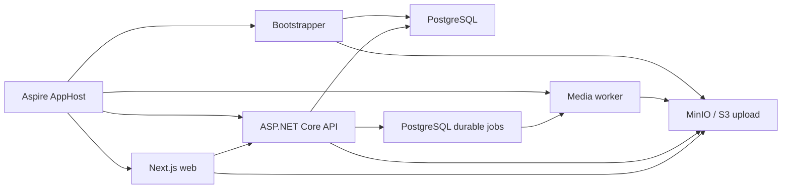

# Hook2Stream source

`src` содержит первый исполняемый срез Hook2Stream: от регистрации и release brief до прямой загрузки и серверной нормализации media.

## Topology



## Projects

| Project | Responsibility |
|---|---|
| `Hook2Stream.Domain` | Entities, lifecycle state and domain enums |
| `Hook2Stream.Application` | Contracts, validation, media policy and ports |
| `Hook2Stream.Infrastructure` | EF Core/PostgreSQL, S3, durable queue, FFmpeg/ffprobe ingest |
| `Hook2Stream.Api` | Clerk-authenticated `/api/v1`, uploads, releases, assets, jobs and SSE |
| `Hook2Stream.Worker` | Leased background job execution and media processing |
| `Hook2Stream.Bootstrapper` | Database migrations and object-storage bucket/CORS bootstrap |
| `Hook2Stream.ServiceDefaults` | OpenTelemetry, service discovery and health endpoints |
| `Hook2Stream.AppHost` | Local Aspire topology: PostgreSQL, MinIO, backend and web |
| `web` | Next.js landing and authenticated release setup |
| `tests` | Unit, API integration and AppHost topology tests |

## Local development

```bash
dotnet tool restore
npm ci --prefix src/web
dotnet run --project src/Hook2Stream.AppHost
```

The AppHost generates and persists local PostgreSQL and MinIO passwords in .NET user secrets, then reuses path-scoped data volumes across restarts. The volume names include the AppHost path identity, so parallel clones and worktrees do not share local state. MinIO CORS for direct browser uploads is configured by the container environment; the storage adapter can apply bucket CORS for compatible S3 providers.

When both Clerk settings are absent, the Development AppHost automatically supplies a fixed local user and a per-run bearer token to the API and web app. The local scheme only accepts loopback requests and is rejected outside Development. Configure both settings to exercise the real Clerk flow:

```bash
dotnet user-secrets --project src/Hook2Stream.AppHost set "Clerk:Issuer" "https://your-instance.clerk.accounts.dev"
dotnet user-secrets --project src/Hook2Stream.AppHost set "Clerk:PublishableKey" "pk_test_..."
```

A partial Clerk configuration fails fast. Running the Next.js app by itself does not enable local authentication.

Keep each generated storage password paired with its volume. PostgreSQL only applies `POSTGRES_PASSWORD` while initializing an empty data directory, so changing or deleting `Parameters:postgres-password` while retaining its volume prevents the dependency gate from becoming ready. Legacy installs can remove the unused `hook2stream-postgres-data` and `hook2stream-minio-data` volumes after stopping AppHost; the next run creates clean path-scoped replacements.

The worker expects `ffmpeg` and `ffprobe` in `PATH`. Originals are never rewritten; derivatives use versioned object keys.

## Contracts

Building `Hook2Stream.Api` writes `Hook2Stream.Api/openapi/Hook2Stream.Api.json`. Regenerate the checked-in frontend schema after an API contract change:

```bash
dotnet build src/Hook2Stream.Api/Hook2Stream.Api.csproj
npm run generate:api --prefix src/web
```

`web/src/lib/api-schema.d.ts` is generated and must not be edited manually.

## Verification

```bash
dotnet test src/Hook2Stream.slnx
npm run check --prefix src/web
npm run lint --prefix src/web
npm run build --prefix src/web
npm run test:e2e --prefix src/web
```

## Deliberate boundary

This increment ends when one release has validated audio, cover, 3–10 visuals, lyrics/instrumental mode and rights attestation. Analysis with WhisperX/Essentia, hook review, campaign planning, Remotion rendering, billing and ZIP export are intentionally the next increments.
