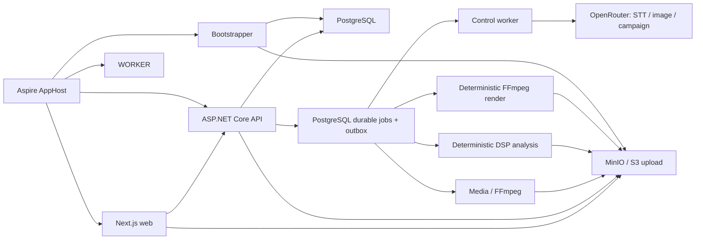

# Hook2Stream source

`src` содержит исполняемый MP3-first срез Hook2Stream: от регистрации и загрузки одного MP3 до revision-based review транскрипта, artwork, hooks и 18-item campaign. В локальном профиле внешние AI/media providers заменяются детерминированными fixtures.

## Topology



## Projects

| Project | Responsibility |
|---|---|
| `Hook2Stream.Domain` | Entities, immutable revisions, workflow lanes and domain enums |
| `Hook2Stream.Application` | API/provider contracts, validation, media policy and ports |
| `Hook2Stream.Infrastructure` | EF Core/PostgreSQL, S3, capability-routed queue, FFmpeg and fixture/external providers |
| `Hook2Stream.Api` | Authenticated `/api/v1`, MP3 quick upload, workflow/review, assets, jobs and SSE |
| `Hook2Stream.Worker` | Leased background execution, outbox dispatch and capability handlers |
| `Hook2Stream.Bootstrapper` | Database migrations and object-storage bucket/CORS bootstrap |
| `Hook2Stream.ServiceDefaults` | OpenTelemetry, service discovery and health endpoints |
| `Hook2Stream.AppHost` | Local Aspire topology: PostgreSQL, MinIO, backend and web |
| `web` | Next.js landing and authenticated release setup |
| `tests` | Unit, API integration and AppHost topology tests |

## Local development

```bash
dotnet tool restore
npm ci --prefix src/web
dotnet run --project src/Hook2Stream.AppHost
```

The AppHost generates and persists local PostgreSQL and MinIO passwords in .NET user secrets, then reuses path-scoped data volumes across restarts. The volume names include the AppHost path identity, so parallel clones and worktrees do not share local state. MinIO CORS for direct browser uploads is configured by the container environment; the storage adapter can apply bucket CORS for compatible S3 providers.

When both Clerk settings are absent, the Development AppHost automatically supplies a fixed local user and a per-run bearer token to the API and web app. The local scheme only accepts loopback requests and is rejected outside Development. Configure both settings to exercise the real Clerk flow:

```bash
dotnet user-secrets --project src/Hook2Stream.AppHost set "Clerk:Issuer" "https://your-instance.clerk.accounts.dev"
dotnet user-secrets --project src/Hook2Stream.AppHost set "Clerk:PublishableKey" "pk_test_..."
```

A partial Clerk configuration fails fast. Running the Next.js app by itself does not enable local authentication.

Keep each generated storage password paired with its volume. PostgreSQL only applies `POSTGRES_PASSWORD` while initializing an empty data directory, so changing or deleting `Parameters:postgres-password` while retaining its volume prevents the dependency gate from becoming ready. Legacy installs can remove the unused `hook2stream-postgres-data` and `hook2stream-minio-data` volumes after stopping AppHost; the next run creates clean path-scoped replacements.

The media worker expects `ffmpeg` and `ffprobe` in `PATH`. Originals are never rewritten; derivatives and provider staging objects use versioned keys. Default development configuration uses deterministic fixture providers. Production uses separate capability pools without local neural models:

- `media` — FFmpeg/ffprobe ingest and normalization;
- `analysis` — deterministic FFmpeg/DSP beat, section and energy extraction;
- `control` — pipeline reconciliation and OpenRouter transcription, artwork and campaign planning;
- `render` — deterministic FFmpeg template rendering;
- `export` — validation and immutable ZIP assembly.

Workers lease only matching capabilities. A lease token fences late attempts; only .NET commits canonical business state after validating a sidecar manifest.

## MP3-first API flow

1. `POST /api/v1/releases/audio-uploads` with `Idempotency-Key`, rights confirmation and external-AI consent creates an `Unscheduled` project, bound attestation, audio asset and direct-upload session atomically.
2. Existing upload completion starts ingest through the outbox. Deterministic analysis and OpenRouter transcription begin once the audio master is ready and consent remains current.
3. `PUT /api/v1/releases/{id}/setup` confirms metadata; the existing rights endpoint confirms rights before artwork generation.
4. `/transcript`, `/artwork`, `/hooks` and `/campaign` expose immutable revisions. Mutations require current `If-Match`; asynchronous generation commands also require `Idempotency-Key`.
5. `GET /api/v1/releases/{id}/workflow` is the reload-safe aggregate of lane progress, blockers and next action. `GET /api/v1/releases/{id}/events` streams ordered project events, resumes from `Last-Event-ID` (or `?after=`), and uses workflow polling as fallback; job-level SSE remains available for focused diagnostics.

Automatic transcription has a supported quality baseline for `en` and `ru`. WAV, prepared lyrics, user cover and custom visuals remain optional advanced sources; they are not required by the main MP3 flow.

## Contracts

Building `Hook2Stream.Api` writes `Hook2Stream.Api/openapi/Hook2Stream.Api.json`. Regenerate the checked-in frontend schema after an API contract change:

```bash
dotnet build src/Hook2Stream.Api/Hook2Stream.Api.csproj
npm run generate:api --prefix src/web
```

`web/src/lib/api-schema.d.ts` is generated and must not be edited manually.

## Verification

```bash
dotnet test src/Hook2Stream.slnx
npm run check --prefix src/web
npm run lint --prefix src/web
npm run build --prefix src/web
npm run test:e2e --prefix src/web
```

## Implementation boundary

The repository contains the MP3-first domain/API/UI foundation, revision invalidation, provider ports, durable orchestration, OpenRouter adapters and deterministic media processors. A fixture can prove contracts and the exact 18-item recipe, but is never selected as a production AI provider.

The repository includes deterministic analysis, clean FFmpeg render and validated ZIP assembly. Production readiness still requires an OpenRouter key configured for Zero Data Retention, a real-provider staging smoke for the pinned models, deployed Stripe Checkout/catalog/webhooks, infrastructure configuration, golden-media evaluation and the staged rollout described in the product requirements. No local neural-model image or sidecar is required.
